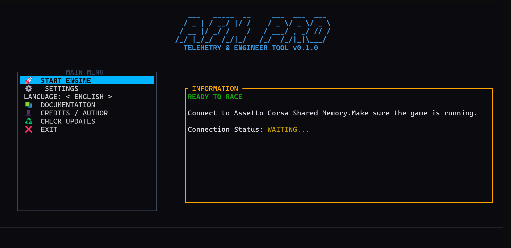
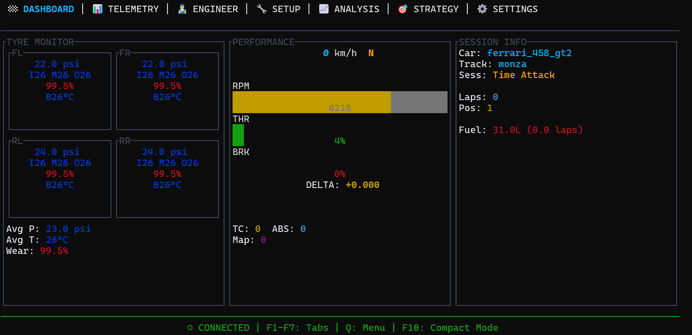
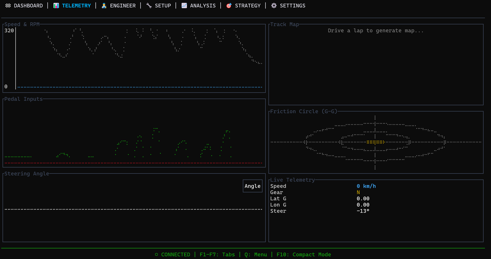
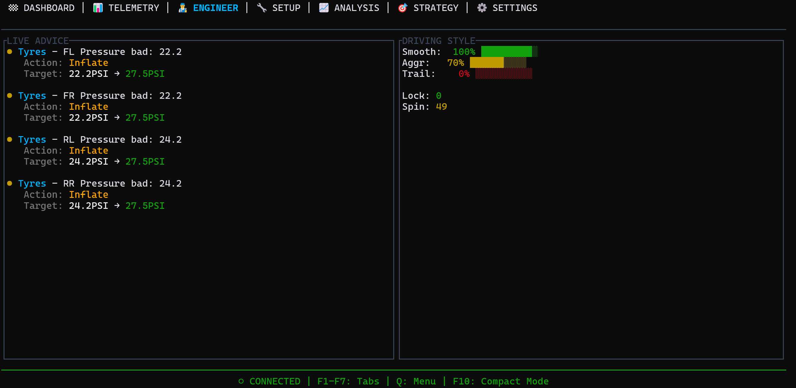
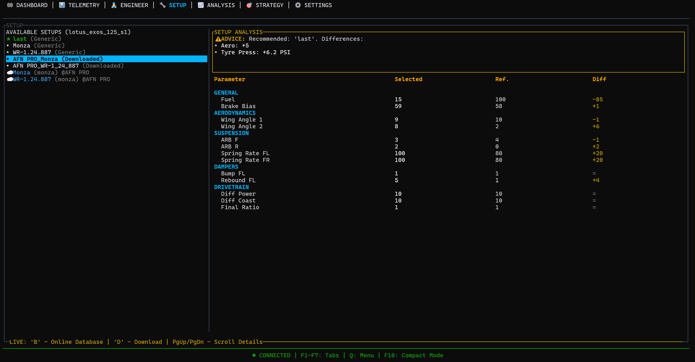
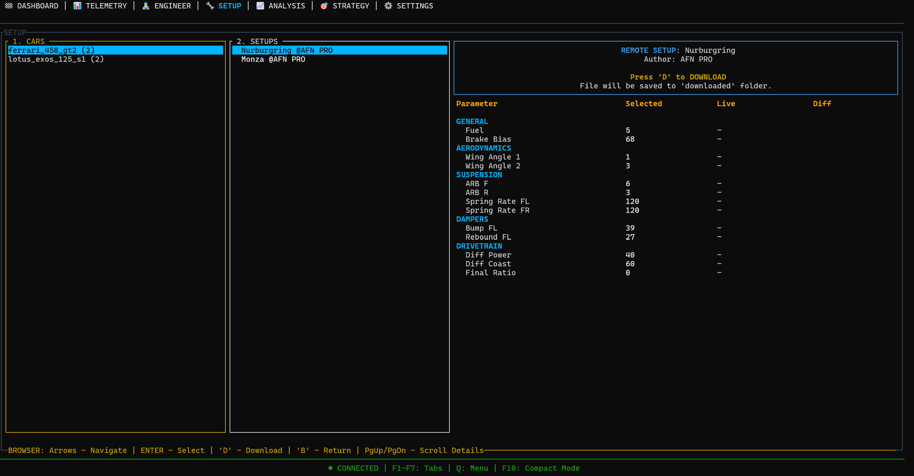
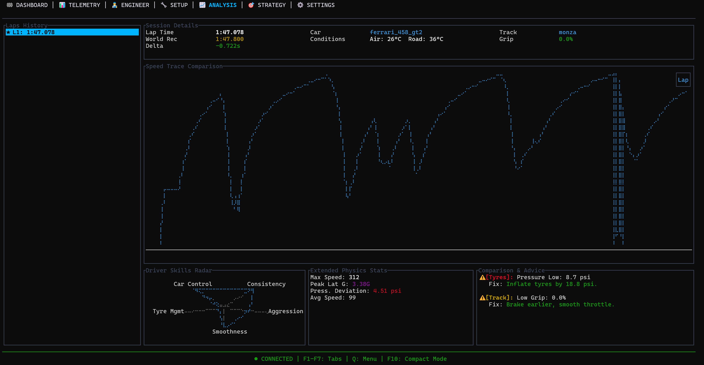
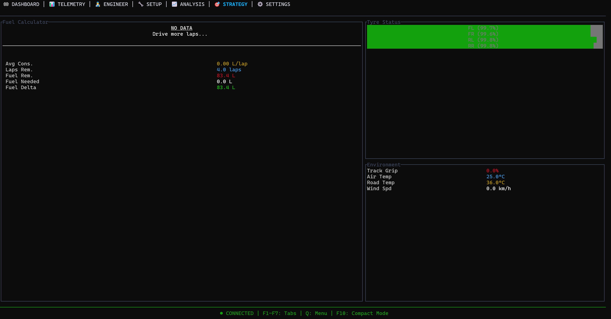

# 🏎️ AC Pro Engineer

**AC Pro Engineer** is a standalone telemetry and race engineer tool designed for performance and utility. Unlike heavy electron-based overlays, this tool runs in a **Terminal User Interface (TUI)** using Rust.

It provides real-time analysis, live engineering advice, and a **one-click Setup Cloud** ecosystem.

## 🚀 Why Use This?
* **Zero FPS Impact:** Utilizes <0.1% CPU and minimal RAM. Perfect for competitive racing and low-end PCs.
* **Hacker Aesthetics:** Professional TUI design. No bloat, just data.
* **Cloud Setup Database:** Browse and download community setups directly from the app.

---

## ✨ Features Walkthrough

### **F1: Dashboard**

Your main mission control.
* **Tyre Monitor:** Live tracking of pressures, temperatures (Inner/Middle/Outer), wear levels, and brake temperatures with color-coded alerts.
* **Performance:** Speed, Gear, RPM bar, and Live Delta.
* **Session Info:** Current position, fuel levels, lap count, and electronics status (TC, ABS, Map).

### **F2: Telemetry**

Deep dive into physics in real-time.
* **Live Graphs:** Speed vs RPM, Pedal Inputs (Throttle/Brake), and Steering Angle history.
* **Friction Circle (G-G):** Visualizes lateral and longitudinal G-forces to help you maximize grip usage.
* **Track Map:** Auto-generated map as you drive the lap.

### **F3: Race Engineer**

An AI copilot analyzing your driving.
* **Live Advice:** Get actionable feedback while driving (e.g., *"Tyres cold"*, *"Lockups detected"*, *"Inflate FL Tyre"*).
* **Driving Style:** Analyzes your Smoothness, Aggression, and Trail Braking technique.
* **Error Counters:** Tracks lockups, wheel spin, and traction loss events.

### **F4: Setup Manager**
**The Killer Feature.** Compare local files or download new ones.

**1. Local Comparison**

* **Instantly compare** your active setup against any local file.
* **Highlights differences** in fuel, aero, alignment, and dampers.
* **Engineer Verdict:** Tells you if the setup matches the car/track conditions.

**2. Cloud Browser (Press 'B')**

* **Online Database:** Browse community setups for your specific car and track.
* **One-Click Install:** Press `'D'` to download. The tool automatically places the `.ini` file in the correct Assetto Corsa folder.

### **F5: Analysis**

Post-lap breakdown to find speed.
* **Speed Trace:** Compare your speed trace against your best lap or world records.
* **Skill Radar:** A spider-chart evaluating your Consistency, Car Control, Tyre Management, Smoothness, and Aggression.
* **Coach Report:** Text-based summary of where you are losing time and how to fix it.

### **F6: Strategy**

Race planning tools.
* **Fuel Calculator:** Estimates laps remaining and fuel needed based on live consumption data.
* **Environment:** Monitors track grip, air/road temperatures, and wind speed.
* **Tyre Status:** Visual wear bars for long stints.

---

## 🎮 Controls
Since this is a terminal app, navigation uses keyboard shortcuts:

| Key | Action |
|:---:|---|
| **F1 - F7** | Switch Tabs (Dashboard, Telemetry, Engineer, etc.) |
| **B** | Open/Close Setup Browser (Only in Setup Tab) |
| **D** | Download Selected Setup (Only in Setup Tab) |
| **PageUp / PageDown** | Scroll details lists |
| **Q** | Quit Application |

---

## 📦 Installation
1. Download the latest `ac_pro_engineer.exe` from the Releases page.
2. Run the application.
3. Start Assetto Corsa and drive!

### ⚠️ False Positive Warning
Since this is a new tool written in Rust that reads game memory, Windows Defender might flag it as a false positive. **This is safe to use.** Please add it to exclusions if necessary.

---

*If you enjoy this tool, consider supporting the development and server costs!*