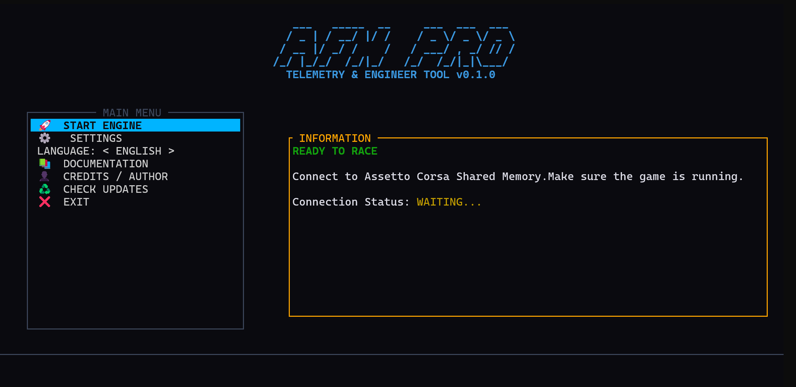
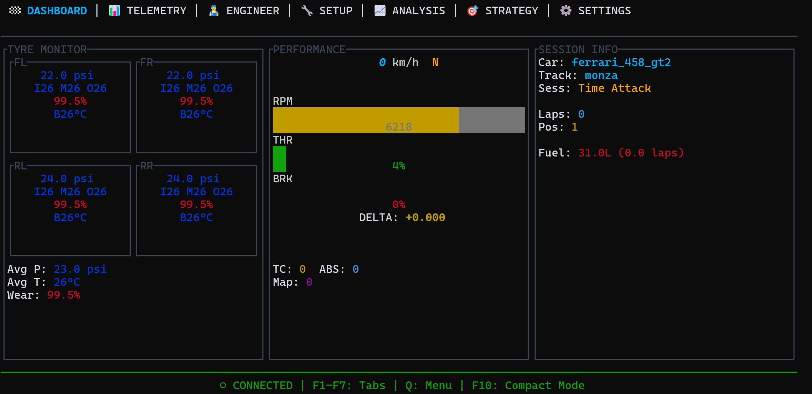
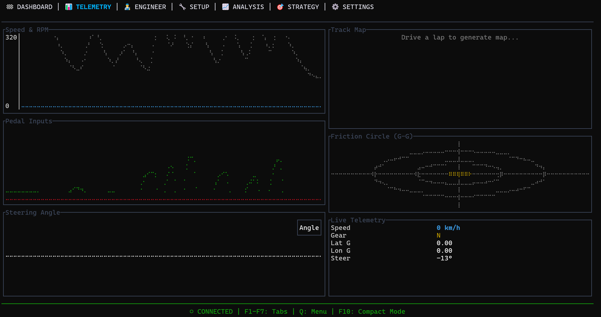
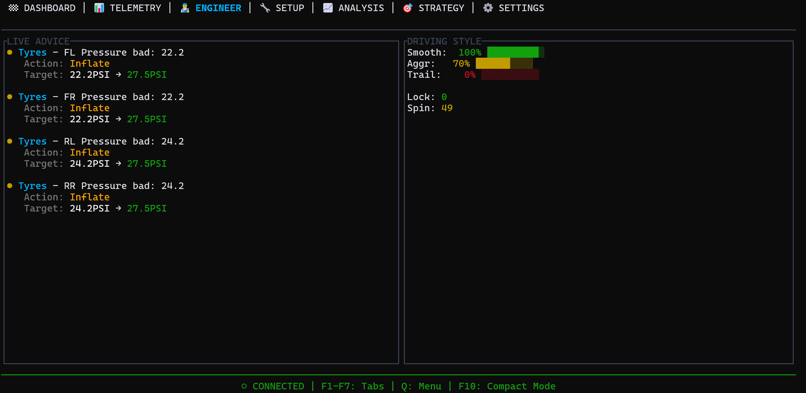
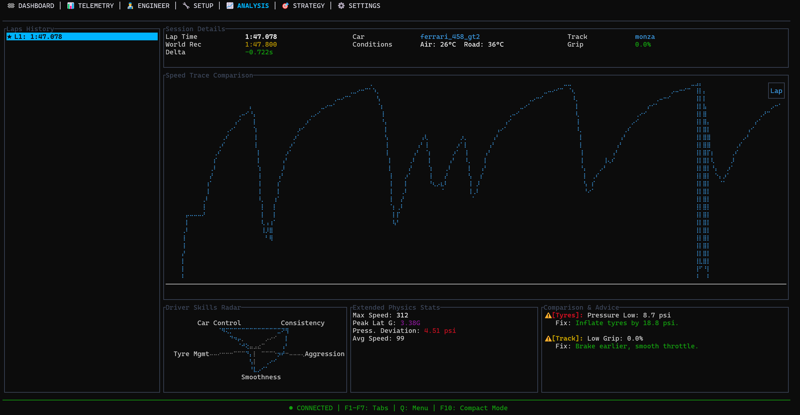
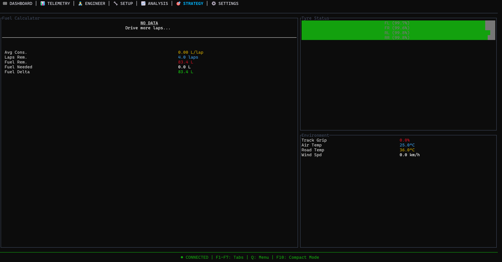

# 🏎️ AC Pro Engineer

[](https://github.com/Rgosh/ac-pro-engineer/releases)
[](LICENSE)
[](https://github.com/Rgosh/ac-pro-engineer/stargazers)
[](#linux-section)

**AC Pro Engineer** is a standalone telemetry and race engineer tool designed for pure performance and utility. Unlike
heavy Electron-based overlays, this tool runs in a **Terminal User Interface (TUI)** using Rust for maximum speed and
zero lag.

It provides real-time analysis, live engineering advice, telemetry recording, and a **one-click Setup Cloud** ecosystem.

> ⭐ **Support the Project**
> If you find this tool useful, please give it a **Star on GitHub**! It helps visibility and motivates further
> development.


 
---

### 🛡️ SECURITY & TRANSPARENCY

**False Positive Warning:** Since this tool is written in Rust and performs high-precision memory reading to fetch
telemetry, some antivirus software (Windows Defender/Google) may flag it as a false positive (Trojan/Wacatac).

* **100% Open Source:** You don't need to trust the `.exe`. You can audit the code or compile it yourself from source.
* **Safe Behavior:** The tool **only reads** telemetry data. It does not modify game files or inject code.
* **Recommendation:** If flagged, please add the folder to your exclusions.

---

## 🚀 Why Use This?

* **Zero FPS Impact:** Utilizes **<0.1% CPU** and minimal RAM. Perfect for competitive racing and low-end PCs.
* **Hacker Aesthetics:** Professional TUI design. No bloat, just raw data.
* **Telemetry Persistence:** Save your best laps and compare them later.
* **Smart Updater:** Automatic updates with safe rollback capability.

---

## ✨ Features Walkthrough

### **F1: Dashboard**


Your main mission control.

* **Tyre Monitor:** Live tracking of pressures, temperatures (I/M/O), wear levels, and brake thermals.
* **Performance:** Speed, Gear, RPM bar, and Live Delta.
* **Session Info:** Fuel levels, lap count, and electronics status (TC, ABS, Map).

### **F2: Telemetry**


Deep dive into physics in real-time.

* **Live Graphs:** Speed vs RPM, Pedal Inputs, and Steering Angle history.
* **Friction Circle (G-G):** Visualizes lateral/longitudinal G-forces to maximize grip.
* **Track Map:** Auto-generated map as you drive.

### **F3: Race Engineer**


An AI copilot analyzing your driving.

* **Live Advice:** Actionable feedback while driving (e.g., *"Tyres cold"*, *"Lockups detected"*).
* **Driving Style:** Analyzes Smoothness, Aggression, and Trail Braking.
* **Counters:** Tracks lockups, wheel spin, and traction loss events.

### **F4: Setup Manager**

**The Killer Feature.** Compare local files or download new ones.

* **Local Comparison:** Highlights differences in fuel, aero, alignment, and dampers.
* **Cloud Browser (Press 'B'):** Browse community setups for your car/track combo.
* **One-Click Install (Press 'D'):** Automatically downloads and installs the `.ini` file to the correct folder.

### **F5: Analysis (New in v0.1.3)**


Save, Load, and Compare.

* **Save ('S') & Load ('L'):** Record laps to JSON files with full metadata (Car, Track, Conditions).
* **Comparison Mode ('C'):** Load a reference lap ("Ghost") and overlay it against your current session to find time
  gaps.
* **Skill Radar:** Spider-chart evaluating Consistency, Car Control, and Aggression.

### **F6: Strategy**


Race planning tools.

* **Fuel Calculator:** Estimates laps remaining based on live consumption.
* **Environment:** Monitors track grip, temperatures, and wind.

---

## 🔄 Launcher & Auto-Updater (New in v0.1.4)

The tool now features a robust self-updating launcher:

* **Auto-Check:** Checks for updates on startup.
* **Safe Rollback:** Creates `.bak` backups of your previous version.
* **Version Carousel:** Use **Left/Right Arrows** in the update menu to switch between installed versions instantly.

---

## 🎮 Controls

Navigation uses keyboard shortcuts for maximum efficiency:

|     Key     | Context      | Action                                   |
|:-----------:|--------------|------------------------------------------|
| **F1 - F7** | Global       | Switch Tabs (Dashboard, Telemetry, etc.) |
|    **Q**    | Global       | Quit Application                         |
|    **B**    | Setup Tab    | Open/Close Setup Browser                 |
|    **D**    | Setup Tab    | Download Selected Setup                  |
|    **S**    | Analysis Tab | **Save** current lap to file             |
|    **L**    | Analysis Tab | Open **Load** Menu                       |
|    **C**    | Analysis Tab | Toggle **Comparison** Mode               |

---

## 📦 Installation

1. Download the latest `ac_pro_engineer.exe` from
   the [Releases page](https://github.com/Rgosh/ac-pro-engineer/releases).
2. Run the application.
3. Start Assetto Corsa and drive!

### 🛠️ Building from Source

If you prefer to build it yourself (requires Rust installed):

```bash
git clone [https://github.com/Rgosh/ac-pro-engineer.git](https://github.com/Rgosh/ac-pro-engineer.git)
cd ac-pro-engineer

cargo build --release

cargo build --release
```

<a name="linux-section"></a>

## 

The tool can show different information from the game by reading the game's shared memory. However, it is not
possible to directly access a Windows app's shared memory from a Linux app. So for that to work, we need
a small helper Windows tool [`shm-bridge.exe`](https://github.com/poljar/shm-bridge). This repository contains
a modified version of the bridge, which can be stopped by entering `exit` from the command line, instead of `Ctrl-C`.

Unlike the native Windows version, `ac_pro_engineer` on Linux **must be** started before the game (`acs.exe`) to create
the necessary shared memory links. It is not required to start the app before the `Content Manager`.

### Building for Linux

1. Build a Linux verison of `ac_pro_engineer`:
   ```shell
   cargo build --bin ac_pro_engineer --release
   ```
2. Build a *Windows* version of `shm-bridge.exe`
   ```shell
   cargo build --bin shm-bridge --target x86_64-pc-windows-gnu --release
   ```
3. Optional. For simplicity, copy both binary files into the same directory:
   ```shell
   mkdir bin \
   && cp target/release/ac_pro_engineer ./bin \
   && cp target/x86_64-pc-windows-gnu/release/shm-bridge.exe ./bin
   ```

### Running on Linux

1. Put both `ac_pro_engineer` (Linux version) and `shm-bridge.exe` (Windows version) into the same folder.
2. Make sure [protontricks](https://github.com/Matoking/protontricks) is installed.
3. Run `ac_pro_engineer`.
4. Run the game.
