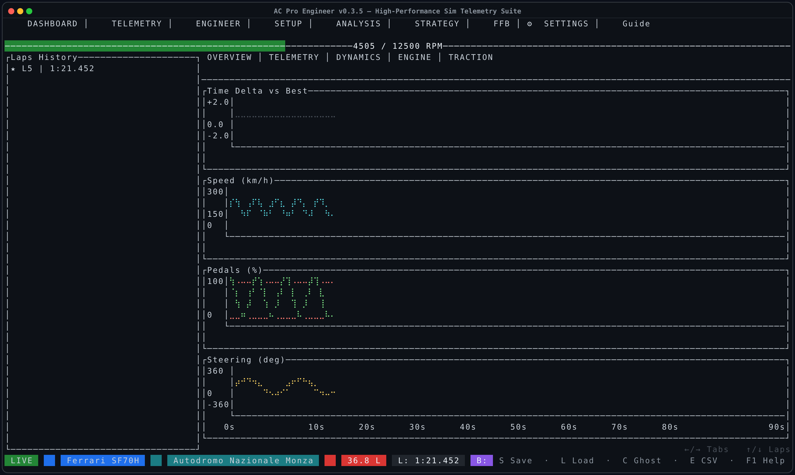

# 🏎️ AC Pro Engineer — Assetto Corsa Telemetry, Race Engineer & In-Game Overlay

[](https://github.com/Rgosh/ac-pro-engineer/releases)
[](LICENSE)
[](https://github.com/Rgosh/ac-pro-engineer/stargazers)
[](#windows)
[](#linux--steam-deck--proton)
[](https://www.rust-lang.org)
[](https://github.com/Rgosh/ac-pro-engineer/actions/workflows/release.yml)

**AC Pro Engineer** is a free, open-source **Assetto Corsa telemetry app** and
**virtual race engineer** for sim racing. It reads the game's shared memory
directly, analyses tyre temperatures and pressures, brake heat, fuel, lap deltas
and driving style, and gives you spoken-plain engineering advice while you
drive — in a fast terminal dashboard on your second screen **and** in an
**in-game overlay** built as a Custom Shaders Patch (CSP) Lua app.

It runs on **Windows** and on **Linux / Steam Deck under Proton**, costs about
**0.1 % of one CPU core**, and touches nothing in your game folder except its own
overlay app.

> **Keywords:** Assetto Corsa telemetry, AC telemetry app, sim racing telemetry
> software, virtual race engineer, tyre pressure calculator, cold pressure
> calculator, fuel strategy calculator, stint planner, FFB clipping meter,
> MoTeC CSV export, ghost lap comparison, Custom Shaders Patch app, CSP Lua
> overlay, Assetto Corsa Linux, Assetto Corsa Proton, Steam Deck sim racing,
> shared memory telemetry, ratatui TUI, Rust sim racing tools.


> ⭐ **If this is useful, star the repo.** It is the only marketing this project
> has.

---

## Contents

| | |
|---|---|
| [What it does](#what-it-does) | the short version |
| [Install](#install) | Windows, Linux, from source |
| [The in-game overlay](#the-in-game-overlay) | the CSP panel window by window, and the Linux bridge |
| [Every screen](#every-screen) | all nine tabs, with pictures |
| [Keyboard](#keyboard) | defaults, and how to rebind them |
| [Command line](#command-line) | every flag of every binary |
| [Configuration file](#configuration-file) | every key, and where it lives |
| [Troubleshooting](#troubleshooting) | symptoms, causes, fixes |
| [Linux / Steam Deck / Proton](#linux--steam-deck--proton) | getting AC + CSP + CM to run at all |
| [For developers](#for-developers) | architecture, tests, contributing |
| [Security](#security--why-your-antivirus-might-complain) | why a telemetry reader looks suspicious |

**Русскоязычным:** установка и решение проблем ниже одинаковы; интерфейс
переключается на русский по `Ctrl+L` или в Настройки → СИСТЕМА. Подробный список
изменений каждой версии — по-русски в [CHANGELOG.md](CHANGELOG.md).

---

## What it does

**While you drive**, on a second screen or in the game itself:

- **Tyre thermal and pressure work.** Live pressure and inner/middle/outer
  temperature per corner, the distance from your target hot pressure, and a
  **cold pressure calculator** that tells you what to set in the setup screen to
  arrive at that target once the tyres are up to temperature.
- **A race engineer that groups what it sees.** Four cold tyres is one sentence,
  not four. Advice is ranked by severity, and the same lines reach the in-game
  overlay — up to eight of them, however many you ask for.
- **Fuel and stint strategy.** Consumption per lap measured from your own laps,
  laps remaining, fuel needed to finish, and how short you are.
- **Lap timing with a real ghost.** Delta against your own recorded best lap
  rather than whatever reference the game picked, plus sector splits on tracks
  with two, three or four sectors.
- **FFB clipping.** Whether your wheel is saturating and losing every detail
  above the clip point.
- **Driving style analysis.** Smoothness, aggression, trail braking, lockups,
  wheelspin, coasting and scrubbing, counted rather than guessed.

**Between sessions:**

- **Lap history and comparison**, with a ghost trace overlaid on yours.
- **MoTeC-compatible CSV export**, named after the car, track and lap.
- **Setup Cloud** — browse community setups by car and install them into AC
  without restarting the game.
- **A built-in guide**: sixteen chapters on braking, differentials, aero,
  tyre thermodynamics, suspension frequencies, dampers, FFB and wet setups.

**And the things that are usually missing:**

- **It computes nothing in the game.** The desktop side does the work; the CSP
  panel reads a 712-byte struct and draws it. Lua runs on Assetto Corsa's render
  thread, so anything else would be a stutter.
- **Everything in the overlay can be switched off**, block by block.
- **Every keyboard shortcut can be rebound**, and every on-screen hint is printed
  from the binding, so it cannot tell you the wrong key.

---

## Install

### Windows

1. Download the latest `ac_pro_engineer` from the
   [Releases page](https://github.com/Rgosh/ac-pro-engineer/releases).
2. Unzip it anywhere and run `ac_pro_engineer.exe`.
3. Start Assetto Corsa.

That is all. The application finds your Assetto Corsa install by itself, writes
the in-game panel into `assettocorsa/apps/lua/ac_pro_engineer/` on startup, and
creates the shared memory the panel reads. There is no bridge and nothing to
start in a particular order.

### Linux / Steam Deck

1. Download the Linux archive from the
   [Releases page](https://github.com/Rgosh/ac-pro-engineer/releases) and unpack
   it. `shm-bridge.exe` sits next to `ac_pro_engineer` — keep them together.
2. Run `./ac_pro_engineer`.
3. **For the in-game overlay**, start the bridge inside the game's Proton prefix
   and leave it running:

   ```bash
   protontricks-launch --appid 244210 shm-bridge.exe
   ```

4. Start Assetto Corsa.

The desktop application works without the bridge. The **overlay** does not: the
application writes its frame into `/dev/shm` itself, and only a Windows process
inside the prefix can give that file the Win32 name CSP is allowed to open.

If Assetto Corsa itself does not run properly under Proton yet, do
[the prefix setup](#linux--steam-deck--proton) first — that is a separate problem
and it has its own section.

### From source

```bash
git clone https://github.com/Rgosh/ac-pro-engineer.git
cd ac-pro-engineer
cargo run --release
```

Needs a recent stable Rust. To build the Linux bridge as well you need the
Windows target and MinGW:

```bash
rustup target add x86_64-pc-windows-gnu
```

```bash
cargo build --release -p shm-bridge --target x86_64-pc-windows-gnu
```

Or use the packaging script, which does both and lays out an archive:

```bash
./build_release.sh
```

---

## The in-game overlay

The overlay is a **Custom Shaders Patch Lua app**. You need CSP installed; the
rest is automatic.

**It installs itself.** Every time the application starts it writes the panel
into `assettocorsa/apps/lua/ac_pro_engineer/`, and rewrites it whenever it
differs from what the running build ships. So updating the application updates
the panel, with no step to forget. Enable **AC Pro Engineer** in CSP's app
sidebar once and it stays.

**It is reachable before the race.** The application publishes a frame from its
launcher screen and while Assetto Corsa has nothing in shared memory yet, so the
panel opens in the garage saying *waiting for the car* rather than claiming the
application is not running. Settings, versions and the link state are all there
while you wait.

Every picture below is the real panel, drawn by the real panel code. They are
generated by [`apps/lua/love/portraits.sh`](apps/lua/love/portraits.sh), which
runs each window on its own under the LÖVE harness and photographs it.

### The windows

Five, each a separate entry in CSP's sidebar, moved and sized independently.

#### AC Pro Engineer — the panel


Speed and gear, a shift bar that changes colour through the power band, the four
corners with pressure, temperature, brake heat and life, then delta and lap
times, fuel, and the session. Every block here can be switched off.

#### — advice


The engineer's lines, on their own, so they can sit where you actually look
rather than pushing the numbers down the panel. Severity travels with each
line — `i`, `!`, `!!` in green, yellow and red — because the same sentence
should not mean one thing on the desktop and another in the car.

#### — telemetry


Every field in the frame, as it arrived, plus the flag bits. For the question
the panel deliberately does not answer: *is this number reaching the game at
all.*

#### — status


Is the mapping open, is anything arriving, and do the three versions agree. The
first place to look when the panel is empty — and the only place that can tell
you the game loaded an older copy of the application than the one on disk.

### The settings, tab by tab

The settings window, or the gear in the panel's title bar. Settings persist
through CSP's own storage and survive closing the window.

#### Panel — which blocks, which fields, which limits


Every block on or off, then, in its own sub-tabs: which corners to show and how
to arrange them, the temperature and pressure thresholds that decide the
colours — so they mean what they mean for *your* compound — which fields appear
inside each block, and what to draw when there is no session.

#### Advice — how much, and how it reads


How many lines to draw, what the markers look like, whether long lines wrap or
are cut, and whether to show only warnings or only what is critical.

#### Look — screen, size and colour


Text scale, content width and whether the panel grows with its window; a VR mode
with the largest text, a thicker rev bar and more air between blocks; an accent
colour and a fully editable palette.

#### Units


°C/°F, psi/bar, km/h/mph, litres/gallons, and whether lap times are written
short.

#### Console


Typed commands, for what has no widget — and four presets, because "make this
readable at 4K" should be one click.

#### Dev


Only in the window when you ask for it. Draw the panel with no session at all,
with sample advice at every severity, or ignoring what the application asked
for — which is how a layout gets judged without a car on track. The raw frame
and the link state are here too, as tabs.

### The Linux bridge

`shm-bridge.exe` is a small Windows binary that runs inside the Proton prefix and
wraps the files in `/dev/shm` in the Win32 named mappings the game and CSP can
open. It is the only Linux-specific piece.

**Ask it whether the overlay can be seen from inside the prefix:**

```bash
protontricks-launch --appid 244210 shm-bridge.exe --verify
```

It makes exactly the call a CSP script makes, and prints the frame version, the
sequence counter and the application's version. If it opens, the panel can open
it too.

**Ask the desktop side which bridge is in play:**

```bash
cargo run -p ac_core --example bridge_probe
```

It reports the bridge on disk, the bridge running, and the version, protocol and
mapped size of each against what this build needs. The launcher's overlay card
shows the same verdict in one line, and **[B]** on that card downloads a
published bridge — verifying it before it replaces anything and keeping the old
one as `shm-bridge.exe.previous`.

> **⚠️ A bridge older than the frame maps too few bytes, and CSP silently refuses
> the mapping.** No error appears anywhere; the panel just waits forever beside a
> file that is right there. v0.3.5 grew the frame from 440 to 712 bytes, so a
> bridge from an earlier release will not serve it. Press **[B]**, or build one:
>
> ```bash
> cargo build --release -p shm-bridge --target x86_64-pc-windows-gnu
> ```

---

## Every screen

### Launcher


Where the application waits before a session, and where it reports what it found:
your Assetto Corsa install, whether CSP is there, whether the overlay is current,
and which bridge is running. `↑/↓` to move, `←/→` to change a value, `ENTER` to
open, `Q` to quit.

### 1 — Dashboard


Mission control. Per-corner tyre temperature, pressure and life; speed, gear and
a shift bar that turns colour through the power band rather than at the limiter;
TC, ABS, engine map and brake bias; session, car, track, fuel and time remaining.

### 2 — Telemetry


The raw feed: dynamic pressures, tyre core temperature, suspension travel, and a
friction circle showing lateral against longitudinal g. Use it on an out-lap to
watch the tyres come in evenly.

### 3 — Engineer


Three sub-tabs, `←/→` between them:

- **Live feed** — the advice as it is generated, with severity, next to a driving
  style read-out: smoothness, aggression, trail braking, lockups, wheelspin.
- **Post-stint** — the debrief for a finished stint, lap by lap.
- **Pressures** — the cold pressure calculator and a per-corner optimiser: what
  each corner is at, what it should be, and how much to add or let out.

### 4 — Setup


Your local setups for the current car, compared field by field against a
reference. Press `B` for the **Setup Cloud**:


Browse by car, read the setup's details, and press `D` to install it straight
into Assetto Corsa. No restart.

### 5 — Analysis


Lap history and traces: throttle, brake, steering and speed against distance,
with a ghost lap overlaid. `S` saves the selected lap, `L` loads one from disk,
`C` toggles the ghost, `E` exports MoTeC-compatible CSV.



A second sub-tab scores braking, throttle control, consistency, racing line and
tyre management, with a coach report explaining each number.

### 6 — Strategy


The pit wall. Fuel per lap measured from your own laps, laps remaining in the
tank, fuel needed to finish and how far short you are; tyre life projected
forward; track grip, air and road temperature.

### 7 — FFB


Force feedback clipping over time, with the input traces beside it. If the graph
is red you are driving blind through the wheel — lower the gain in AC until the
peaks barely touch yellow.

### 8 — Settings


Five categories, `A` `S` `D` `F` `G` or `←/→`:

- **SYSTEM** — language, update rate, history size, autosave
- **DISPLAY** — pressure and temperature units
- **ENGINEER** — every alert threshold, target hot pressures, ghost delta
- **OVERLAY** — which blocks the overlay gets, how many advice lines, and
  `[I]` install / `[U]` uninstall the panel
- **KEYS** — rebind anything


### 9 — Guide


Sixteen chapters of setup and physics reference, from trail braking to wet
setups to a troubleshooting index. `↑/↓` to move between them.

### Help


`F1` or `?` anywhere opens a page about the tab you are on. Every key it names is
printed from your bindings.

---

## Keyboard

| Key | Where | What it does |
|:---:|:---:|:---|
| **1** – **9** | everywhere | Switch tabs — the digits, not the function keys |
| **Tab** / **Shift+Tab** | everywhere | Next / previous tab |
| **F1** / **?** | everywhere | Help for the current tab |
| **Esc** / **Q** | everywhere | Back to the launcher, then quit |
| **Ctrl+C** | everywhere | Back to the launcher, or quit from it |
| **Ctrl+L** | everywhere | Switch language (English / Русский) |
| **Ctrl+S** | everywhere | Save a screenshot of the current screen |
| **↑ / ↓** | lists | Move through laps, chapters, setups, settings |
| **← / →** | tabs with sub-tabs | Switch sub-tab; change a setting's value |
| **S** | Analysis | Save the selected lap |
| **L** | Analysis | Load a lap from disk |
| **C** | Analysis | Toggle the ghost comparison |
| **E** | Analysis | Export the selected lap as MoTeC CSV |
| **B** | Setup | Open / close the Setup Cloud browser |
| **D** | Setup | Download the selected setup, or open the browser |
| **PgUp / PgDn** | Setup | Scroll the details pane |
| **A S D F G** | Settings | Jump to a settings category |
| **I** / **U** | Settings → OVERLAY | Install / uninstall the in-game panel |
| **O** / **H** | Launcher | Open the review page / hide that banner |

**All of these are defaults.** **Settings → KEYS `[G]`** rebinds any of them:
`ENTER` arms the capture, the next key you press becomes the binding, `DEL`
restores the default and `ESC` cancels. A key another action already holds is
refused with the name of the action holding it, rather than silently shadowing
it. `?` and `Q` stay fixed, because the help modal names them in places a binding
cannot reach.

Bindings are stored as text in `config.json` (`"f1"`, `"ctrl+s"`,
`"shift+tab"`, `"1"`), so you can also edit them in a text editor. Cyrillic
layouts work without switching: bind `s` and `ы` works too.

The hint at the bottom right of every tab is printed from your bindings, so it
always names the key that actually does the thing.

---

## Command line

### `ac_pro_engineer` — the application

```
ac_pro_engineer [OPTIONS]
```

| Flag | What it does |
|---|---|
| `-d`, `--demo` | Run against a built-in simulated session. No game needed — this is the fastest way to see what the application looks like with data in it. |
| `--export-overlay <DIR>` | Write the in-game Lua panel into `<DIR>/ac_pro_engineer` and exit. For a game folder the application may not write to, an install it cannot find, or a second copy of AC. What lands is exactly the panel this build's frame is shaped for. |
| `-l`, `--log-level <LEVEL>` | `trace`, `debug`, `info` (default), `warn`, `error`. `debug` adds the telemetry loop and the overlay writer; `trace` adds every shared-memory read. |
| `--log <FILE>` | Write the log here instead of under the config directory. |
| `-s`, `--silent` | Do not write a log at all. |
| `-h`, `--help` | Full help, with the long explanation of each flag. |
| `-V`, `--version` | Print the version and exit. |

Environment variables the Linux build reads:

| Variable | Effect |
|---|---|
| `AC_PROTON_PATH` | The launcher used to start `shm-bridge.exe`. Defaults to `protontricks-launch`. |
| `AC_TEST_MODE` | Pretend to start the bridge without a Proton prefix. For development. |

### `shm-bridge.exe` — the Linux bridge

Runs **inside** the Proton prefix.

```bash
protontricks-launch --appid 244210 shm-bridge.exe
```

| Flag | What it does |
|---|---|
| *(none)* | Create the mappings and stay running. Type `exit` to stop it cleanly. |
| `--verify` | Open the overlay mapping the way CSP does, print what is in it, and exit. The one check that can only be made from inside the prefix. |
| `--help`, `--version` | As usual. |

### Development binaries and examples

| Command | What it does |
|---|---|
| `cargo run --bin simulator` | Write plausible AC telemetry into shared memory, so the whole application can be exercised with no game. |
| `cargo run --bin tui_tester` | Render every terminal screen to `screenshots/` as PNG. |
| `apps/lua/love/portraits.sh` | Render every *overlay* window and settings tab to `screenshots/` as PNG. |
| `cargo run -p ac_core --example bridge_probe` | Which bridge is on disk, which is running, and whether the overlay can work. |
| `cargo run -p ac_core --example engineer_probe [samples]` | The engineer's advice printed next to the telemetry that produced it. |
| `cargo run -p ac_core --example gen_lua_layout` | Regenerate the panel's `frame_layout.lua` from the Rust struct. |
| `cargo run -p ac_core --example publish_demo_frame` | Publish one known overlay frame, for the Lua conformance check. |
| `luajit apps/lua/tests/run_overlay.lua` | Drive the whole panel under LuaJIT with CSP stubbed. `ACPE_ALL=1` prints every string it drew. |
| `love apps/lua/love` | The panel running under LÖVE, with sliders for every field. `--test` runs it headless; `--shot NAME.png` saves a picture. |

---

## Configuration file

`config.json`, written as you change things and on exit.

| Platform | Path |
|---|---|
| Linux | `~/.config/raceengineer/config.json` |
| Windows | `%APPDATA%\RaceEngineer\RaceEngineer\config\config.json` |

Delete it to start from defaults; the application writes a fresh one. Keys it
does not recognise are ignored, and keys that are missing take their default, so
a config from an older version keeps working.

| Key | Default | What it is |
|---|---|---|
| `language` | `"English"` | `"English"` or `"Russian"` |
| `update_rate` | `16` | Milliseconds between telemetry ticks. Lower is smoother and costs more CPU. |
| `history_size` | `300` | Points kept for the graphs. |
| `auto_save` | `true` | Write settings on exit as well as on change. |
| `pressure_unit` | `"Psi"` | `"Psi"`, `"Bar"` or `"Kpa"` |
| `temp_unit` | `"Celsius"` | `"Celsius"` or `"Fahrenheit"` |
| `shift_point_offset` | `200` | RPM before the limiter that the shift light comes on. |
| `fuel_safety_margin` | `1.0` | Litres kept back in the strategy calculation. |
| `target_tyre_pressure` | `27.5` | The pressure the engineer measures against. |
| `target_hot_pressure_front` / `_rear` | `27.5` / `27.0` | Published to the overlay, which shows your distance from them. |
| `show_ghost_delta` | `true` | Measure the delta against your own best lap rather than AC's meter. |
| `alerts.tyre_pressure_min` / `_max` | `26.0` / `28.5` | Outside this is worth saying. |
| `alerts.tyre_temp_min` / `_max` | `70` / `105` | Cold and overheating, in °C. |
| `alerts.brake_temp_max` | `800` | Above this the brakes are cooking. |
| `alerts.fuel_warning_laps` | `3.0` | Laps of fuel left that triggers the warning. |
| `alerts.wear_warning` | `96` | Tyre life below which it is a warning, as a percentage. |
| `alerts.wear_critical` | `85` | And below which it is critical. |
| `overlay.show_telemetry` / `_engineer` / `_session` / `_timing` / `_fuel` | `true` | Which blocks the overlay is allowed to draw. |
| `overlay.engineer_lines` | `4` | How many advice lines reach the overlay, 0 to 8. |
| `overlay.startup_card` | `true` | Show the install card when the application starts. |
| `keys.*` | see [Keyboard](#keyboard) | One key per action, as text. |
| `data_path` | config directory | Where laps, exports, screenshots and records go. |
| `ac_install_path` | `""` | Force the Assetto Corsa folder. Empty means auto-detect. |
| `ac_documents_path` | `""` | Force the Documents folder AC reads setups from. Under Proton this is inside the prefix. |

The panel's own settings are **not** here — CSP keeps them in its own storage, so
uninstalling and reinstalling the overlay does not lose them.

---

## Troubleshooting

### The application says "AC NOT RUNNING" with Assetto Corsa open

The status bar tells three states apart on purpose:

- **AC NOT RUNNING** — no `acs.exe` process was found. On Linux, make sure you
  are running the game, not just the launcher.
- **AC RUNNING – NO DATA** — the process is there and its shared memory cannot be
  read. On Linux this is almost always `shm-bridge.exe` not running in the
  prefix. On Windows, try starting the application before the game.
- **LIVE** — telemetry is arriving.

### The in-game panel says "Waiting for AC Pro Engineer"

In order, cheapest first:

1. **Is the desktop application running?** The panel draws nothing without it.
2. **On Linux, is the bridge running in the prefix?**

   ```bash
   protontricks-launch --appid 244210 shm-bridge.exe --verify
   ```

   If it cannot open the mapping, start `shm-bridge.exe` in the prefix first.
3. **Is the bridge new enough?**

   ```bash
   cargo run -p ac_core --example bridge_probe
   ```

   A bridge older than the frame maps too few bytes and CSP refuses the mapping
   **without any error**. This is the single most common cause. Press **[B]** on
   the launcher's overlay card, or build a new one.
4. **Is the panel the one this build ships?** The overlay card on the launcher
   compares them. If the game was already running when the application updated
   the files, restart Assetto Corsa — the panel says so itself when it notices.

### The in-game panel says "Waiting for the car"

Nothing is wrong. The application is running and Assetto Corsa has no telemetry
yet — you are in the menus, on a loading screen, or in the garage before the
session goes live. The panel's settings and status windows work throughout.

### The panel says "Version mismatch"

The application and the installed panel disagree about the shape of the frame.
Reinstall the panel: **Settings → OVERLAY → `[I]`**, or

```bash
ac_pro_engineer --export-overlay ~/somewhere
```

and copy the folder into `assettocorsa/apps/lua/` yourself.

### The panel is not in CSP's app list at all

- Custom Shaders Patch has to be installed. The launcher's overlay card says
  whether it found it.
- The folder has to be `assettocorsa/apps/lua/ac_pro_engineer/` — CSP finds an
  app's entry point by folder name.
- Enable **AC Pro Engineer** in CSP's app sidebar once.

### The panel forgets its settings

Fixed in v0.3.5. Older versions declared `LAZY = FULL`, which tells CSP to unload
the script when the last window closes. Update the application; it rewrites the
panel on startup.

### The overlay window is tiny / unreadable on a 4K screen

Settings → Look → Screen has presets for 1080p, 1440p, 4K and VR. Or type
`--scale 2 --width 680 --bar 12` in the Console tab.

### The terminal says "TERMINAL TOO SMALL"

The UI needs 80×20 to lay out. Resize the window; the application asks for
140×40 at startup but terminals are free to ignore that.

### A key does nothing / does the wrong thing

Settings → KEYS `[G]` lists every action with the key it is on. If a binding
shows as *unreadable*, `config.json` has a typo in it — press `DEL` on that row
to restore the default.

### Content Manager shows a black screen, or invisible text

That is a Proton prefix problem, not this application. See
[Linux / Steam Deck / Proton](#linux--steam-deck--proton).

### The engineer is telling me my tyres are worn out on lap three

Fixed in v0.3.5 — the critical threshold used to be derived from the warning one
and fired at 94 % tyre life. If you are on an older version, raise
`alerts.wear_warning`. On v0.3.5 the two thresholds are separate and settable in
Settings → ENGINEER.

### Where are my laps, exports and screenshots?

Under `data_path` in the config — by default the config directory, in
`laps/`, `exports/` and `screenshots/`.

### How do I report a bug usefully?

The **status window** in the game shows the panel version, the application
version and the frame version at once; `bridge_probe` prints the bridge's. Quote
those four, say Windows or Linux, and attach the log — by default under the
config directory in `logs/ac_engineer.log`. Run with `--log-level debug` if the
problem is a connection that comes and goes.

---

## Linux / Steam Deck / Proton

Getting **Assetto Corsa, CSP and Content Manager** to run under Proton at all is
a separate problem from this application, and the reason the in-game panel works
once it is solved: CSP loads through Windows libraries Proton ships only as
stubs. Without them the launcher opens on a black screen and the game crashes as
soon as a Lua script runs.

**All the commands, in order.** `244210` is Assetto Corsa's Steam app id.

```bash
protontricks 244210 --force vcrun2019 corefonts
```

```bash
protontricks 244210 d3dcompiler_47
```

```bash
protontricks 244210 dwrite
```

What each one is for:

- **vcrun2019** — the Microsoft Visual C++ 2015–2022 runtimes CSP compiles and
  runs its Lua against. `--force` overwrites conflicting older versions already
  in the prefix.
- **corefonts** — Arial, Times New Roman and the rest, so interface layout does
  not fall apart around missing metrics.
- **d3dcompiler_47** — Direct3D's shader compiler. WPF, which Content Manager is
  written in, cannot draw its own controls without it.
- **dwrite** — switches DirectWrite to the native Windows library. This is what
  removes the invisible text inside Content Manager, and the same override is how
  CSP hooks the game.

**The registry entry that removes the black screen.** Open the prefix's registry
editor:

```bash
protontricks 244210 regedit
```

Under `HKEY_CURRENT_USER\Software\Microsoft\`, create a key named
`Avalon.Graphics`, and inside it a 32-bit DWORD called `DisableHWAcceleration`
set to `1`. That turns off the broken hardware acceleration the launcher window
would otherwise ask for.

**Steam launch options** for Assetto Corsa:

```
PROTON_NO_ESYNC=1 PROTON_NO_FSYNC=1 WINEDLLOVERRIDES="winemenubuilder.exe=d;dwrite=n,b" %command%
```

`PROTON_NO_ESYNC` / `PROTON_NO_FSYNC` trade a little throughput for the absence
of micro-stutter while Lua scripts and heavy traffic run. The override is what
makes Wine load the libraries installed above instead of its own stubs — CSP does
not load at all without `dwrite=n,b`.

**If CSP crashes on track load with `segoeui.ttf is missing`,** drop that font
into `steamapps/common/assettocorsa/content/fonts/system/`.

**To start over**, `protontricks 244210 wipe` removes the prefix's Windows
environment without touching cars, tracks or mods — then run through the steps
above from the top.

---

## For developers

### The shape of it

```
core/          ac_core — telemetry, analysis, the engineer, the overlay frame
tui/           ac_tui  — the terminal application, the key map, every screen
shm-bridge/    the Windows binary that bridges /dev/shm on Linux
apps/lua/      the CSP panel, and two harnesses that run it without the game
tests_suite/   integration tests over the whole pipeline
```

The desktop application computes everything and publishes a 712-byte
`#[repr(C)]` `OverlayFrame` once per tick. The panel reads fields and calls
ImGui. **Three artefacts encode that struct** — the application, `shm-bridge.exe`
and `apps/lua/ac_pro_engineer/frame_layout.lua` — and changing it means changing
all three. `core/src/overlay/frame.rs` has the rules; `CLAUDE.md` has the
procedure and the traps.

The panel itself is a tree:

```
apps/lua/ac_pro_engineer/
  ac_pro_engineer.lua      the entry point CSP loads, and nothing else
  frame_layout.lua         GENERATED from the Rust struct
  manifest.ini             the windows CSP opens
  acpe/settings.lua        what the driver chose, and making it stick
  acpe/i18n.lua            the panel's own words, in two languages
  acpe/theme.lua           colours, accents, the editable palette
  acpe/layout.lua          text sizes, spacing, the measured window
  acpe/format.lua          numbers into strings, once per settled frame
  acpe/frame.lua           the shared block and the snapshot drawn from it
  acpe/blocks.lua          one function per thing on screen
  acpe/controls.lua        the widgets the settings window is built from
  acpe/console.lua         typed commands, for what has no widget
  acpe/windows/*.lua       one file per window
```

### Checks, cheapest first

```bash
luajit apps/lua/tests/run_overlay.lua
```

Drives every window the panel exposes under real LuaJIT with CSP stubbed, and
insists the telemetry reached the screen, the settings reached storage, they
survived a reload, and a frame with no car is distinguished from a missing
application.

```bash
love apps/lua/love --test --settings
```

The panel under LÖVE for 120 frames, non-zero on a throw. `--shot name.png` takes
a picture.

```bash
cargo run --bin simulator     # in one terminal
cargo run -p ac_core --example engineer_probe
```

Fake telemetry, then the engineer's advice printed next to the numbers that
produced it.

```bash
cargo test --workspace
```

```bash
cargo clippy --workspace --all-targets -- -D warnings
```

```bash
cargo clippy --workspace --all-targets --target x86_64-pc-windows-gnu -- -D warnings
```

Both targets, before pushing. `CLAUDE.md` and `AGENTS.md` describe the working
rules, including the ones learned the hard way.

### Contributing

Issues and pull requests are welcome. Conventional Commits, and a commit body
that says what was wrong, why it mattered and how it was verified. If you change
the overlay frame, regenerate the layout and rebuild the bridge — there are tests
that will fail if you do not, and they exist because forgetting has cost
evenings.

---

## Security — why your antivirus might complain

This application reads Assetto Corsa's shared memory. That is what telemetry
tools do, and it is also a pattern some antivirus heuristics dislike.

- **It only reads.** It does not modify game files, inject code, or touch
  anything but its own overlay folder under `apps/lua/`.
- **It is entirely open source.** Audit it, or build it yourself from this
  repository.
- **The releases are built by GitHub Actions** from the tagged commit.
- If Windows Defender flags it, add the folder to your exclusions.

---

## Licence and credits

Released under the [MIT licence](LICENSE).

`shm-bridge` began as [Damir Jelić's](https://github.com/poljar) work on bridging
Wine shared memory and is used and extended here under the same terms.

Built with [ratatui](https://ratatui.rs), [tokio](https://tokio.rs) and
[Custom Shaders Patch](https://acstuff.ru/patch/). Not affiliated with Kunos
Simulazioni.
