# 🏎️ AC Pro Engineer — Assetto Corsa Telemetry, Race Engineer & In-Game Overlay

[](https://github.com/Rgosh/ac-pro-engineer/releases)
[](LICENSE)
[](https://github.com/Rgosh/ac-pro-engineer/stargazers)
[](#windows)
[](#linux--steam-deck--proton)
[](https://www.rust-lang.org)
[](https://github.com/Rgosh/ac-pro-engineer/actions/workflows/release.yml)

**AC Pro Engineer** is a free, open-source **Assetto Corsa telemetry app** and
**virtual race engineer** for sim racing. It reads the game's shared memory
directly, analyses tyre temperatures and pressures, brake heat, fuel, lap deltas
and driving style, and gives you spoken-plain engineering advice while you
drive — in a fast terminal dashboard on your second screen **and** in an
**in-game overlay** built as a Custom Shaders Patch (CSP) Lua app.

It runs on **Windows** and on **Linux / Steam Deck under Proton**, costs about
**0.1 % of one CPU core**, and touches nothing in your game folder except its own
overlay app.

> **Keywords:** Assetto Corsa telemetry, AC telemetry app, sim racing telemetry
> software, virtual race engineer, tyre pressure calculator, cold pressure
> calculator, fuel strategy calculator, stint planner, FFB clipping meter,
> MoTeC CSV export, ghost lap comparison, Custom Shaders Patch app, CSP Lua
> overlay, Assetto Corsa Linux, Assetto Corsa Proton, Steam Deck sim racing,
> shared memory telemetry, ratatui TUI, Rust sim racing tools.

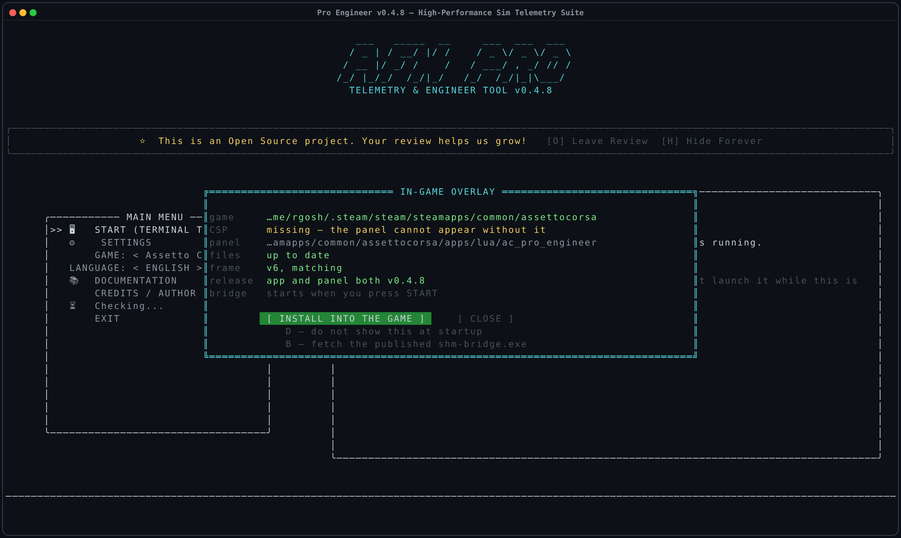

> ⭐ **If this is useful, star the repo.** It is the only marketing this project
> has.

---

## Contents

| | |
|---|---|
| [What it does](#what-it-does) | the short version |
| [Install](#install) | Windows, Linux, from source |
| [The in-game overlay](#the-in-game-overlay) | the CSP panel window by window, and the Linux bridge |
| [Every screen](#every-screen) | the terminal's nine tabs and the panel's five windows, with pictures |
| [Keyboard](#keyboard) | defaults, and how to rebind them |
| [Command line](#command-line) | every flag of every binary |
| [Configuration file](#configuration-file) | every key, and where it lives |
| [Troubleshooting](#troubleshooting) | symptoms, causes, fixes |
| [Linux / Steam Deck / Proton](#linux--steam-deck--proton) | getting AC + CSP + CM to run at all |
| [For developers](#for-developers) | architecture, tests, contributing |
| [Security](#security--why-your-antivirus-might-complain) | why a telemetry reader looks suspicious |

---

## What it does

**While you drive**, on a second screen or in the game itself:

- **Tyre thermal and pressure work.** Live pressure and inner/middle/outer
  temperature per corner, the distance from your target hot pressure, and a
  **cold pressure calculator** that tells you what to set in the setup screen to
  arrive at that target once the tyres are up to temperature.
- **A race engineer that groups what it sees.** Four cold tyres is one sentence,
  not four. Advice is ranked by severity, and the same lines reach the in-game
  overlay — up to eight of them, however many you ask for.
- **Fuel and stint strategy.** Consumption per lap measured from your own laps,
  laps remaining, fuel needed to finish, and how short you are.
- **Lap timing with a real ghost.** Delta against your own recorded best lap
  rather than whatever reference the game picked, plus sector splits on tracks
  with two, three or four sectors.
- **FFB clipping.** Whether your wheel is saturating and losing every detail
  above the clip point.
- **Driving style analysis.** Smoothness, aggression, trail braking, lockups,
  wheelspin, coasting and scrubbing, counted rather than guessed.

**Between sessions:**

- **Lap history and comparison**, with a ghost trace overlaid on yours.
- **MoTeC-compatible CSV export**, named after the car, track and lap.
- **Setup Cloud** — browse community setups by car and install them into AC
  without restarting the game.
- **A built-in guide**: sixteen chapters on braking, differentials, aero,
  tyre thermodynamics, suspension frequencies, dampers, FFB and wet setups.

**And the things that are usually missing:**

- **It computes nothing in the game.** The desktop side does the work; the CSP
  panel reads a 712-byte struct and draws it. Lua runs on Assetto Corsa's render
  thread, so anything else would be a stutter.
- **Everything in the overlay can be switched off**, block by block.
- **Every keyboard shortcut can be rebound**, and every on-screen hint is printed
  from the binding, so it cannot tell you the wrong key.

---

## Install

### Windows

1. Download the latest `ac_pro_engineer` from the
   [Releases page](https://github.com/Rgosh/ac-pro-engineer/releases).
2. Unzip it anywhere and run `ac_pro_engineer.exe`.
3. Start Assetto Corsa.

That is all. The application finds your Assetto Corsa install by itself, writes
the in-game panel into `assettocorsa/assets/frontends/csp-panel/` on startup, and
creates the shared memory the panel reads. There is no bridge and nothing to
start in a particular order.

### Linux / Steam Deck

1. Download the Linux archive from the
   [Releases page](https://github.com/Rgosh/ac-pro-engineer/releases) and unpack
   it. `shm-bridge.exe` sits next to `ac_pro_engineer` — keep them together.
2. Run `./ac_pro_engineer`.
3. **For the in-game overlay**, start the bridge inside the game's Proton prefix
   and leave it running:

   ```bash
   protontricks-launch --appid 244210 shm-bridge.exe
   ```

4. Start Assetto Corsa.

The desktop application works without the bridge. The **overlay** does not: the
application writes its frame into `/dev/shm` itself, and only a Windows process
inside the prefix can give that file the Win32 name CSP is allowed to open.

If Assetto Corsa itself does not run properly under Proton yet, do
[the prefix setup](#linux--steam-deck--proton) first — that is a separate problem
and it has its own section.

### From source

```bash
git clone https://github.com/Rgosh/ac-pro-engineer.git
cd ac-pro-engineer
cargo run --release
```

Needs a recent stable Rust. To build the Linux bridge as well you need the
Windows target and MinGW:

```bash
rustup target add x86_64-pc-windows-gnu
```

```bash
cargo build --release -p shm-bridge --target x86_64-pc-windows-gnu
```

Or use the packaging script, which does both and lays out an archive:

```bash
./build_release.sh
```

---

## The in-game overlay

The overlay is a **Custom Shaders Patch Lua app**. You need CSP installed; the
rest is automatic.

**It installs itself.** Every time the application starts it writes the panel
into `assettocorsa/assets/frontends/csp-panel/`, and rewrites it whenever it
differs from what the running build ships. So updating the application updates
the panel, with no step to forget. Enable **AC Pro Engineer** in CSP's app
sidebar once and it stays.

**It is reachable before the race.** The application publishes a frame from its
launcher screen and while Assetto Corsa has nothing in shared memory yet, so the
panel opens in the garage saying *waiting for the car* rather than claiming the
application is not running. Settings, versions and the link state are all there
while you wait.

**Five windows**, each a separate entry in CSP's sidebar, moved and sized
independently: the panel, the advice, the raw frame, the link state and the
settings. All five, and every tab of the settings window, are pictured with the
rest of the application's screens under [Every screen](#every-screen).

### The Linux bridge

`shm-bridge.exe` is a small Windows binary that runs inside the Proton prefix and
wraps the files in `/dev/shm` in the Win32 named mappings the game and CSP can
open. It is the only Linux-specific piece.

**Ask it whether the overlay can be seen from inside the prefix:**

```bash
protontricks-launch --appid 244210 shm-bridge.exe --verify
```

It makes exactly the call a CSP script makes, and prints the frame version, the
sequence counter and the application's version. If it opens, the panel can open
it too.

**Ask the desktop side which bridge is in play:**

```bash
cargo run -p ac_core --example bridge_probe
```

It reports the bridge on disk, the bridge running, and the version, protocol and
mapped size of each against what this build needs. The same report is a screen
in the application — `[C]` on **Settings → OVERLAY** — so none of this needs a
terminal or a checkout.

**Which bridge `[B]` fetches.** The one published with *this* release, and only
if there is none, the newest there is. The bridge is not republished every time,
so "newest published" is often older than the application asking for it — and a
bridge one release behind can be the one that cannot serve the frame. If no
bridge for this release has been published, the card says exactly that and gives
you the command to build one, rather than "nothing to fetch". The launcher's overlay card
shows the same verdict in one line, and **[B]** on that card downloads a
published bridge — verifying it before it replaces anything and keeping the old
one as `shm-bridge.exe.previous`.

> **⚠️ A bridge older than the frame maps too few bytes, and CSP silently refuses
> the mapping.** No error appears anywhere; the panel just waits forever beside a
> file that is right there. v0.3.5 grew the frame from 440 to 712 bytes, so a
> bridge from an earlier release will not serve it. Press **[B]**, or build one:
>
> ```bash
> cargo build --release -p shm-bridge --target x86_64-pc-windows-gnu
> ```

---

## Every screen

Both faces of the application: the terminal's launcher and nine tabs first,
then the in-game panel's five windows and every tab of its settings. The
terminal pictures come from `cargo run --bin tui_tester` and the panel's from
[`apps/lua/love/portraits.sh`](apps/lua/love/portraits.sh) — both draw with the
real code, so a screenshot here cannot be out of date with the build that made
it.

### Launcher


Where the application waits before a session, and where it reports what it found:
your Assetto Corsa install, whether CSP is there, whether the overlay is current,
and which bridge is running. `↑/↓` to move, `←/→` to change a value, `ENTER` to
open, `Q` to quit.

### 1 — Dashboard

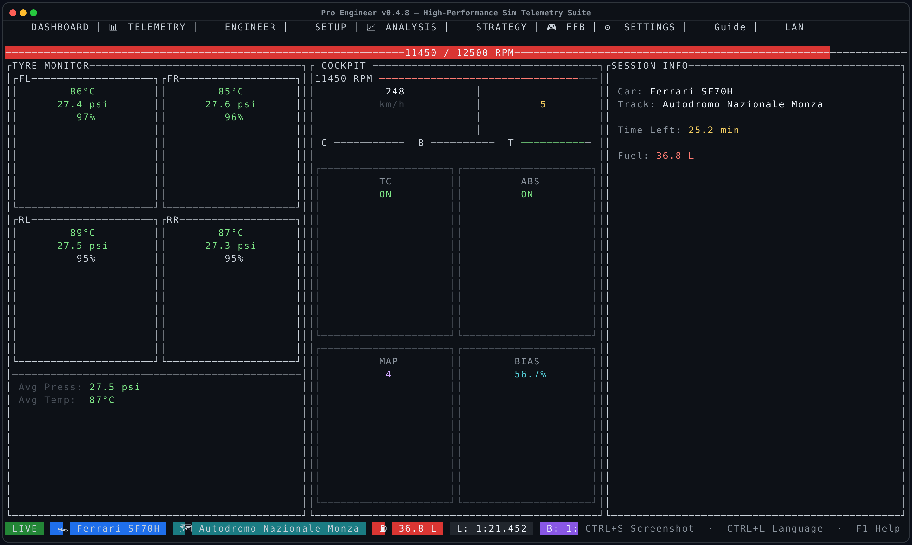

Mission control. Per-corner tyre temperature, pressure and life; speed, gear and
a shift bar that turns colour through the power band rather than at the limiter;
TC, ABS, engine map and brake bias; session, car, track, fuel and time remaining.

### 2 — Telemetry

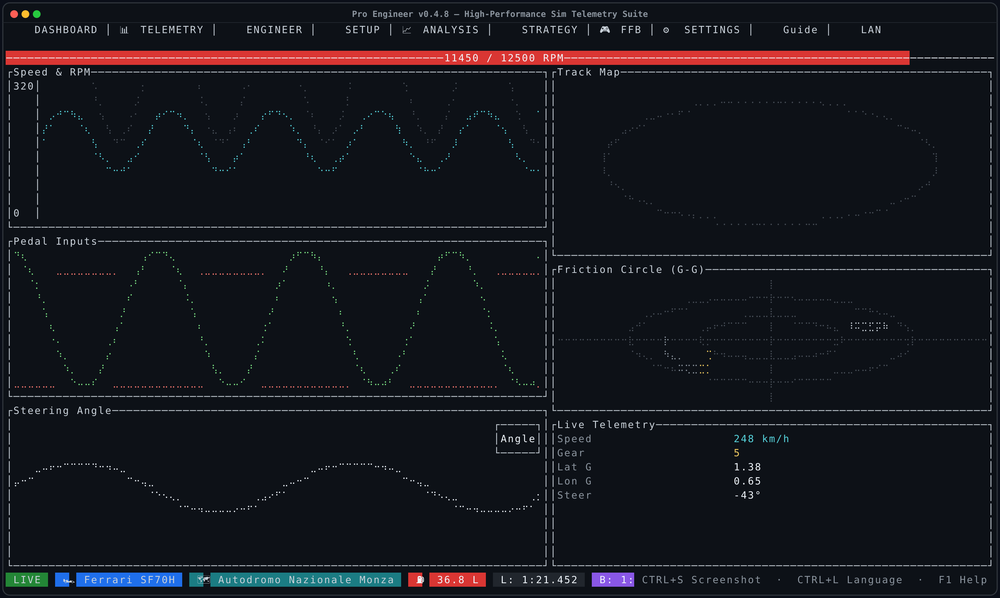

The raw feed: dynamic pressures, tyre core temperature, suspension travel, and a
friction circle showing lateral against longitudinal g. Use it on an out-lap to
watch the tyres come in evenly.

### 3 — Engineer

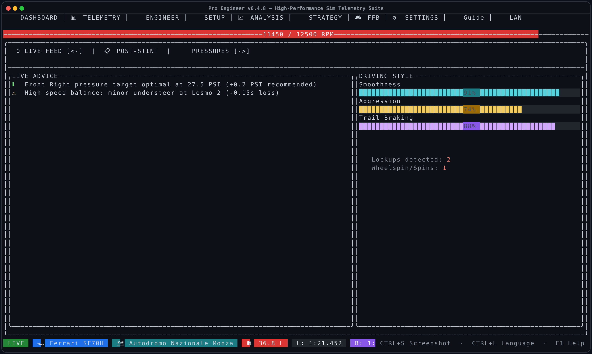

Three sub-tabs, `←/→` between them:

- **Live feed** — the advice as it is generated, with severity, next to a driving
  style read-out: smoothness, aggression, trail braking, lockups, wheelspin.
- **Post-stint** — the debrief for a finished stint, lap by lap.
- **Pressures** — the cold pressure calculator and a per-corner optimiser: what
  each corner is at, what it should be, and how much to add or let out.

### 4 — Setup

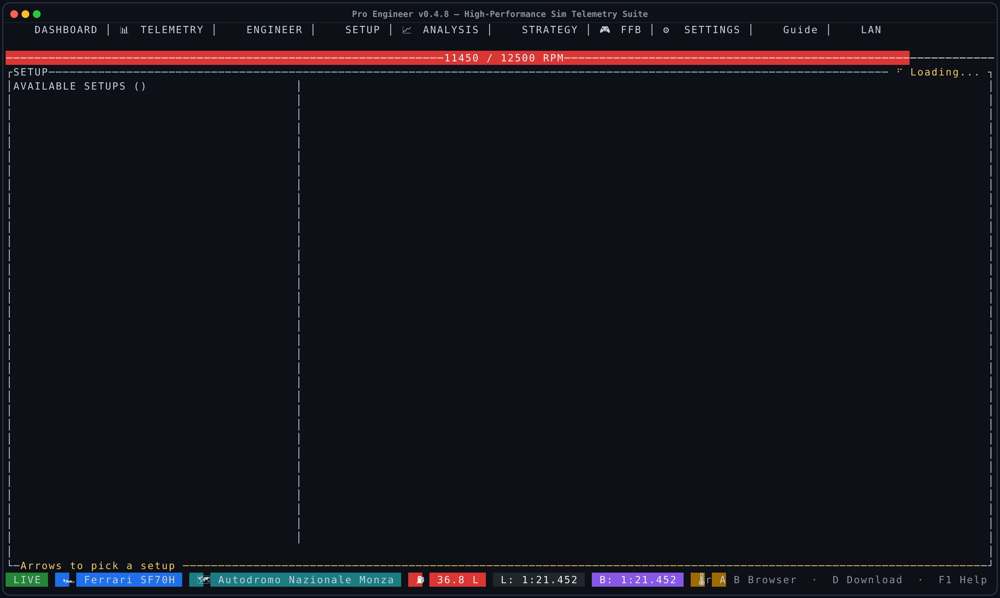

Your local setups for the current car, compared field by field against a
reference. Press `B` for the **Setup Cloud**:

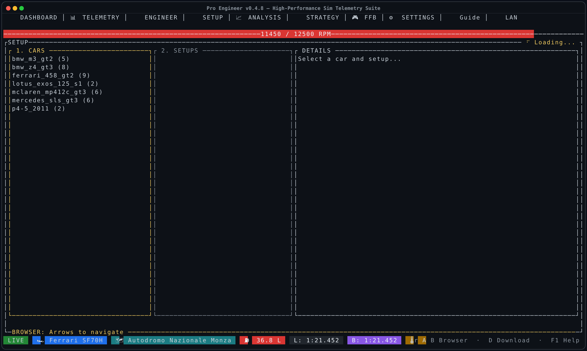

Browse by car, read the setup's details, and press `D` to install it straight
into Assetto Corsa. No restart.

### 5 — Analysis

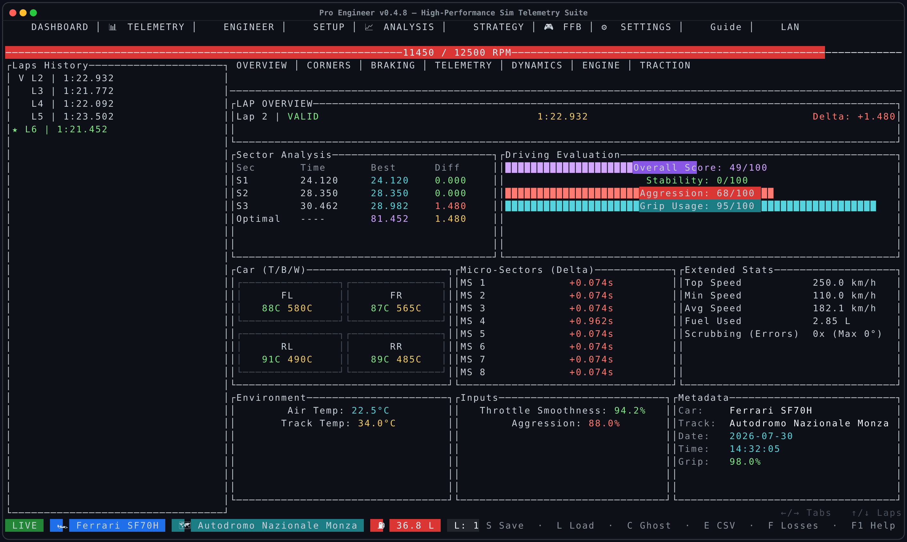

Lap history and traces: throttle, brake, steering and speed against distance,
with a ghost lap overlaid. `S` saves the selected lap, `L` loads one from disk,
`C` toggles the ghost, `E` exports MoTeC-compatible CSV.

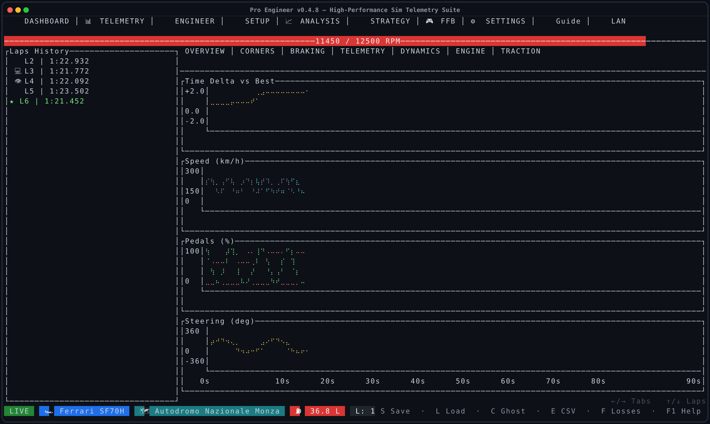

`←/→` moves between six sub-tabs. **TELEMETRY** is the traces above — delta
against your best, speed, both pedals and steering against time. **DYNAMICS**,
**ENGINE** and **TRACTION** break the same lap down further, and **OVERVIEW**
carries the sector split, the driving scores and the per-corner temperatures.

**CORNERS** is where the lap actually went.

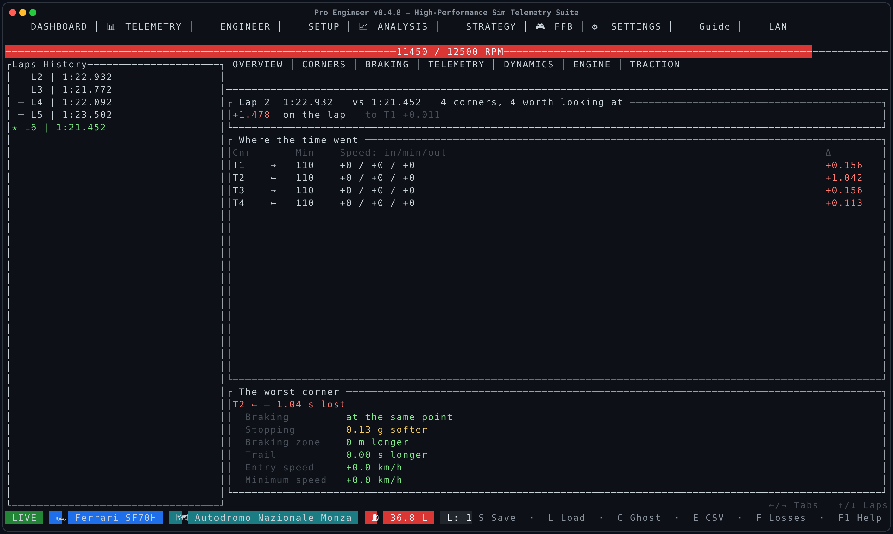

Corners are found in the trace — a stretch where lateral load stays up long
enough to be a corner rather than a kink — so it needs no track data and works
on mods. Each one is charged the track from its own entry to the next corner's
entry, which is where a bad exit is actually paid for, and the per-corner
deltas plus the run to T1 add up to the lap's own delta.

`F` hides everything that cost less than a tenth:

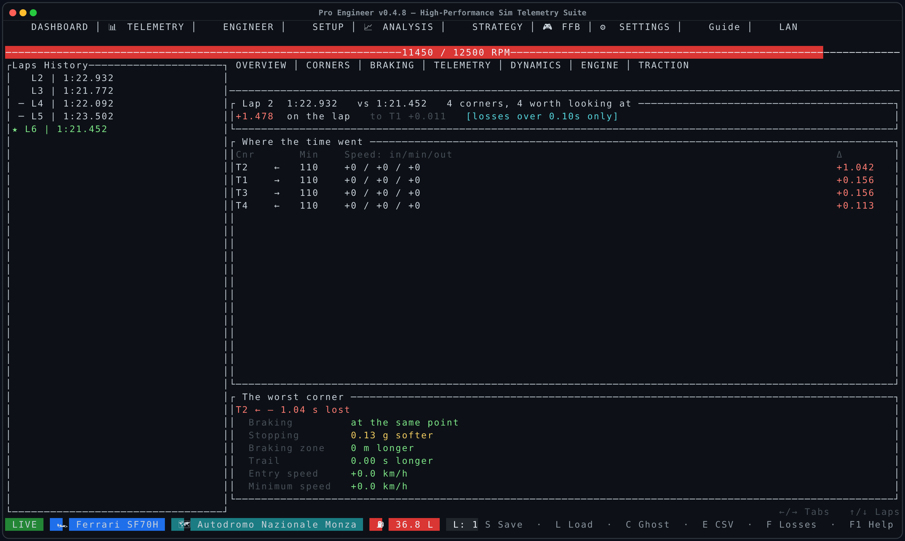

That filter is the point. Twenty corners with a number beside each is another
table to read; the three that cost real time is a job. Under it, the worst
corner is pulled apart — braking point in metres, entry, minimum and exit
speed, and how much later the throttle came back.

Two things it will not do. A corner the reference lap does not have is drawn as
**no comparison** rather than as a delta of zero, because two laps of the same
track can detect a different number of corners and matching them by position in
the list compares T5 against something else entirely. And braking in metres
needs the track's length, which laps saved before v0.3.7 do not carry — it says
"not measured" rather than inventing a number.

### 6 — Strategy

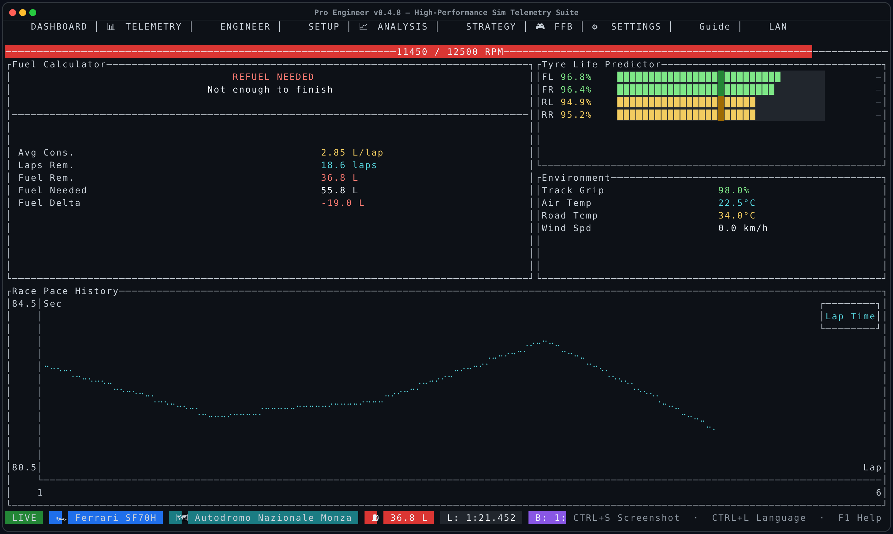

The pit wall. Fuel per lap measured from your own laps, laps remaining in the
tank, fuel needed to finish and how far short you are; tyre life projected
forward; track grip, air and road temperature.

### 7 — FFB

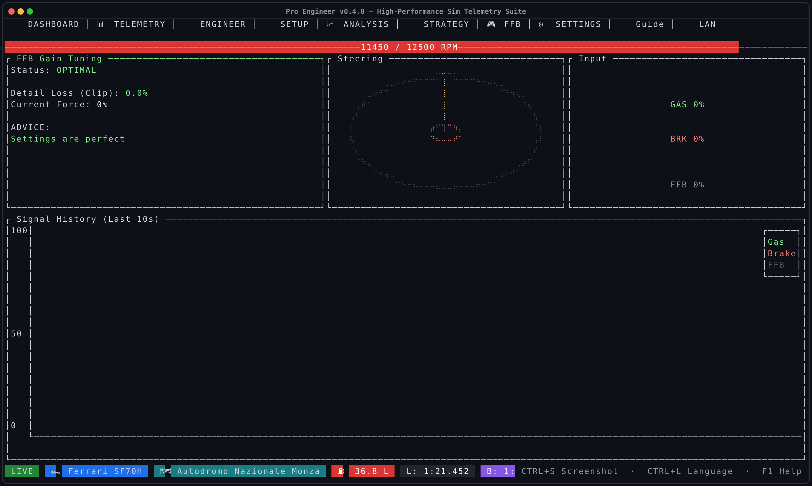

Force feedback clipping over time, with the input traces beside it. If the graph
is red you are driving blind through the wheel — lower the gain in AC until the
peaks barely touch yellow.

### 8 — Settings

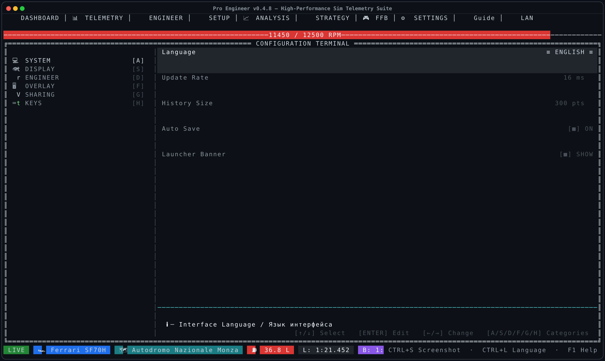

Five categories, `A` `S` `D` `F` `G` or `←/→`:

- **SYSTEM** — language, update rate, history size, autosave
- **DISPLAY** — pressure and temperature units
- **ENGINEER** — every alert threshold, target hot pressures, ghost delta
- **OVERLAY** — which blocks the overlay gets, how many advice lines,
  `[I]` install / `[U]` uninstall the panel, and `[C]` for diagnostics
- **KEYS** — rebind anything

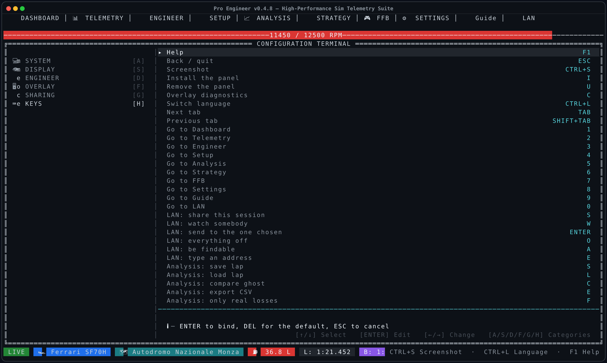

`[C]` on **OVERLAY** answers the one question this program gets asked most —
*why is the panel blank* — without leaving the application:

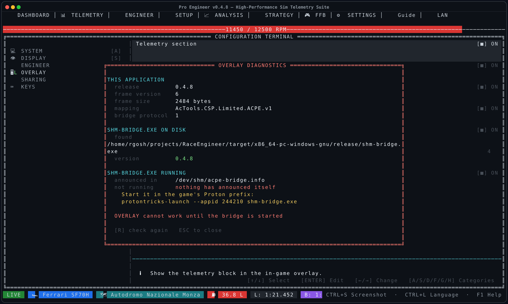

All three pieces that have to agree about a frame, what each one is, and what to
do about the one that does not fit. `[R]` measures again, so starting the bridge
in another window and pressing it is the whole loop. The same report is printed
by `cargo run -p ac_core --example bridge_probe` for anyone already in a
terminal.

### 9 — Guide

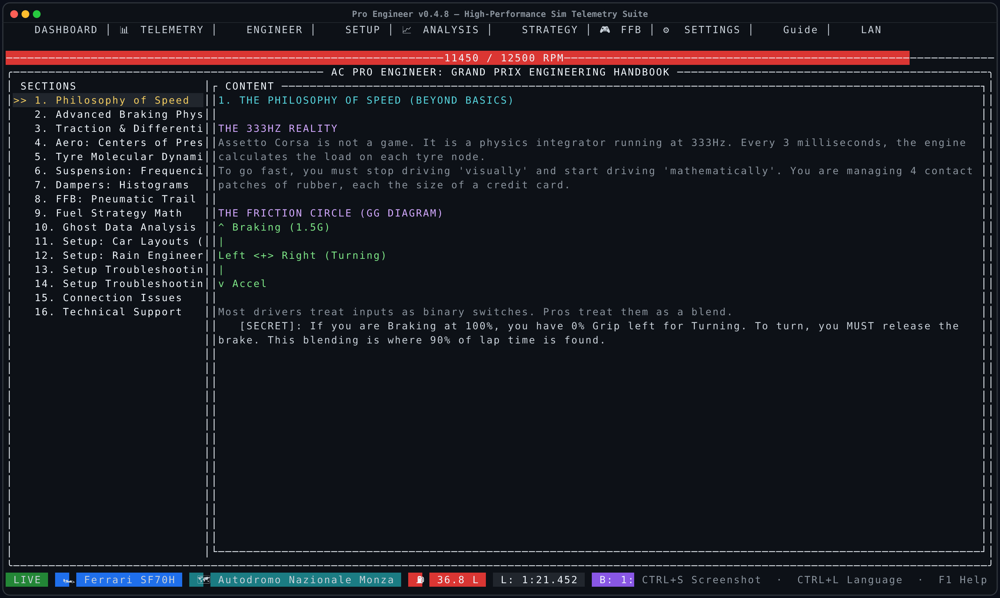

Sixteen chapters of setup and physics reference, from trail braking to wet
setups to a troubleshooting index. `↑/↓` to move between them.

### Help

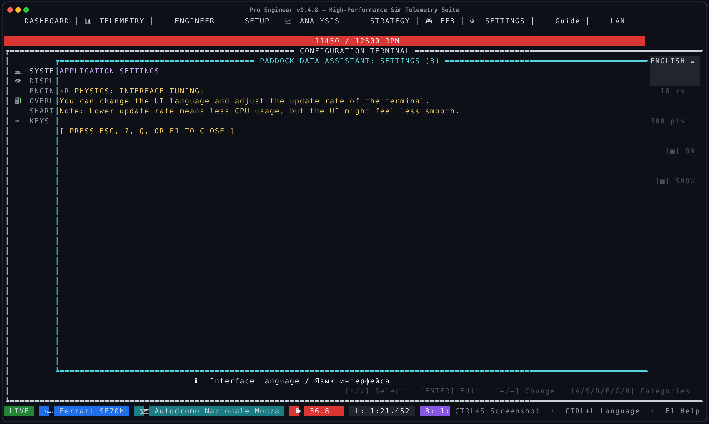

`F1` or `?` anywhere opens a page about the tab you are on. Every key it names is
printed from your bindings.

### In-game — the panel

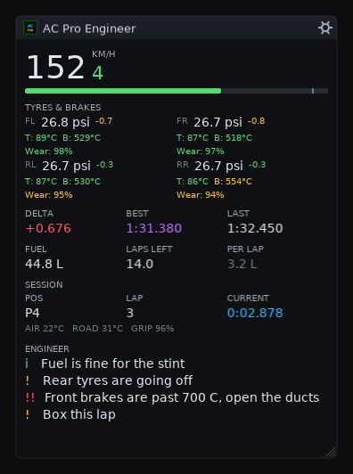

The window CSP opens as **AC Pro Engineer**, and the one that is on screen while
you drive. Top to bottom: speed with the gear beside it, a rev bar that changes
colour through the power band and marks your shift point rather than the
limiter, a **LIMITER** badge in the pits, then the four corners — pressure with
its distance from your target, tyre temperature, brake temperature and life —
then delta, best and last lap, fuel in the tank with laps left and consumption
per lap, and the session: position, lap, air and road temperature, track grip.
The engineer's lines close it off.

Every block on that list can be switched off, and so can most of the fields
inside them. **One-line mode** reduces the whole thing to speed, gear, delta and
fuel.

### In-game — advice

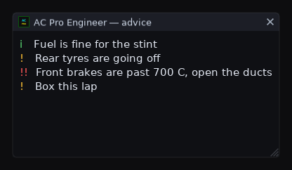

The same engineer lines as the block at the bottom of the panel, in a window of
their own — so they can sit where your eyes already go instead of pushing the
numbers down. Up to eight lines, however many you asked for.

Severity travels with each line rather than being guessed from the words:
`i` green for information, `!` yellow for a warning, `!!` red for critical, the
same three the terminal uses. The marker carries the colour and the sentence
stays in the reading colour, because a wall of red is a wall nobody reads.

### In-game — the lap debrief

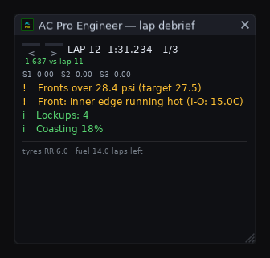

What the engineer made of the lap you have just finished — pressures and
temperatures against your windows, camber per axle, brakes, and how it was
driven. `<` and `>` page through the last three laps.

The paging is local to the panel. The frame only travels one way, so the
application publishes the recent laps and the window picks between what has
already arrived: it works with the game paused and asks the application for
nothing. How many lines to draw, whether to show the lap time and whether a new
lap jumps the window back to it are all in Settings → Debrief; setting the lines
to zero stops the application publishing a debrief at all.

### In-game — telemetry

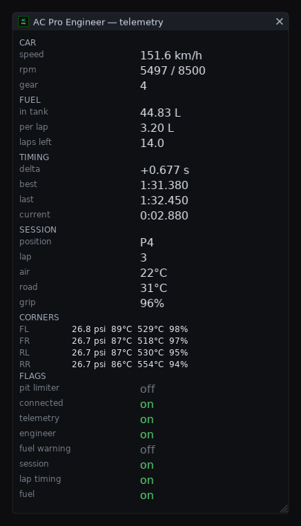

Every field in the frame, as it arrived, with no interpretation on top: car,
fuel, timing, session, the four corners in a row each, and the flag bits the
application is sending. It answers the one question the panel deliberately does
not — *is this number reaching the game at all* — and it is the window to open
when a block is blank and you want to know whether the value is missing or the
switch is off.

### In-game — status

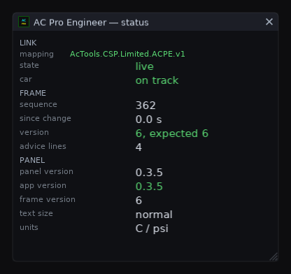

The link, in three parts. **LINK** — the mapping's full name, whether it opened,
whether the frame is live or stale, and whether there is a car on track.
**FRAME** — the sequence counter, how long since it last moved, the frame
version against the one this panel expects, and how many advice lines arrived.
**PANEL** — the panel's version, the *application's* version, and the frame
version.

Those last two are why this window exists. The panel version and the app version
are the only way to notice that Assetto Corsa loaded an older copy of the
application than the one now on your disk — from every other angle the files are
current, the versions match and the panel keeps drawing.

### In-game settings — Panel

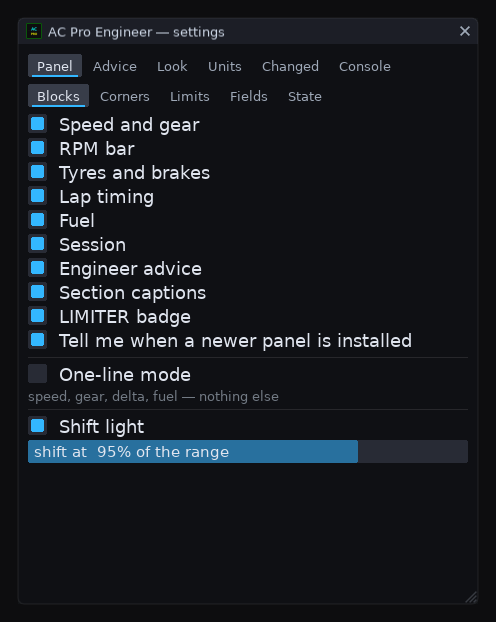

Which blocks the panel draws, in five sub-tabs.

- **Blocks** — every block on or off, section captions, the LIMITER badge, the
  update notice; one-line mode; the shift light and where in the rev range it
  comes on.
- **Corners** — whether each corner shows tyre temperature, brake temperature,
  wear and the distance from your target pressure, and how many decimals a
  pressure gets.
- **Limits** — the thresholds that decide the colours: cold / working / over for
  tyre and brake temperature, and good / worn for life. These are yours, because
  a slick at 95 °C is in its window and a hard at 95 °C is stone cold.
- **Fields** — which individual readings appear inside timing, fuel and session,
  and whether the panel lays them out in two columns, three, or picks.
- **State** — what the desktop application is actually sending, flag by flag.
  A block needs both its flag here and its switch in **Blocks**, and without
  this tab a ticked box with nothing on screen looks like a bug.

### In-game settings — Advice

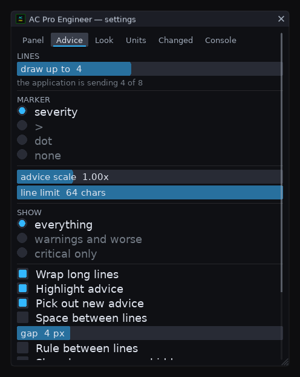

How much the engineer says and how it reads. How many lines to draw, of the
eight the frame can carry, with the number actually arriving printed
underneath — "I asked for eight and see three" is the engineer having three
things to say, and nothing else can tell you that. The marker style, the advice
text scale and where lines are cut. A severity floor, so the panel can be set to
warnings only or critical only. Then wrapping, highlighting, spacing, a rule
between lines, a count of what was hidden, and a plate behind the text for
reading a sentence against a bright sky.

### In-game settings — Debrief

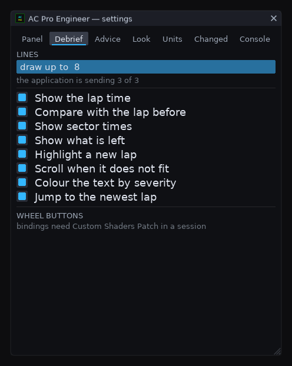

How much the lap debrief says and how you move through it. Lines to draw — zero
switches it off and the application stops publishing one at all — the lap time,
the comparison with the lap before, sector times, what is left of the tyres and
fuel, and whether a finished lap pulls the window back to it.

Underneath: how it looks. A backing plate from transparent to solid black, text
size, line spacing, a rule between lines and upper case — its own numbers rather
than the advice window's, because the two are read in different places.

Paging between laps is `<` and `>` in the window itself.

### In-game settings — Look

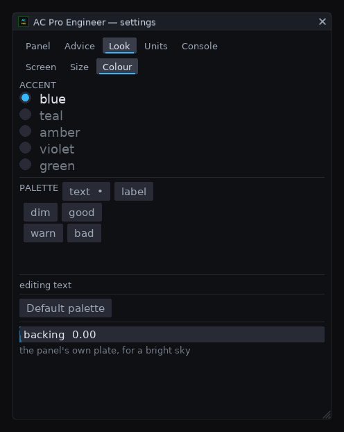

Three sub-tabs.

- **Screen** — presets first, because a panel that opens unreadable at 4K is a
  panel nobody gets as far as configuring; then whether the panel grows with its
  window or keeps a fixed size.
- **Size** — text scale, content width and rev bar height as sliders, three text
  size tiers, and a VR mode: largest text, thicker bar, more air between blocks.
- **Colour** — an accent colour, and a fully editable palette. The swatches
  choose which colour you are editing and one picker edits it, because CSP's
  colour *button* is a swatch that opens nothing. There is a reset, and a
  backing slider for the panel's own plate.

### In-game settings — Units

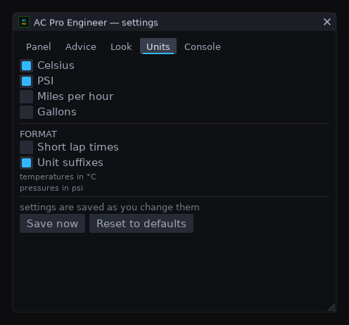

°C or °F, psi or bar, km/h or mph, litres or gallons, whether lap times are
written short, and whether numbers carry their unit. Every one re-formats the
panel immediately rather than at the next lap.

Underneath: whether CSP's storage is available at all, `Save now` and
`Reset to defaults`, and what the last save actually did. Settings are written
as you change them, and a button that saves silently is a button people press
twice and still do not believe.

### In-game settings — Changed

Everything that differs from the defaults: what it is now, what it was, a search
box, and a reset beside each line. The tab carries the count in its own label,
so *have I changed anything* is answered without opening it — and when the panel
is behaving oddly, the setting you do not remember touching is on this list.

The names are the settings file's keys rather than the captions, deliberately:
the list and `ac_pro_engineer_overlay.lua` are then the same vocabulary, so
*which line do I edit* has one answer.

### In-game settings — Console

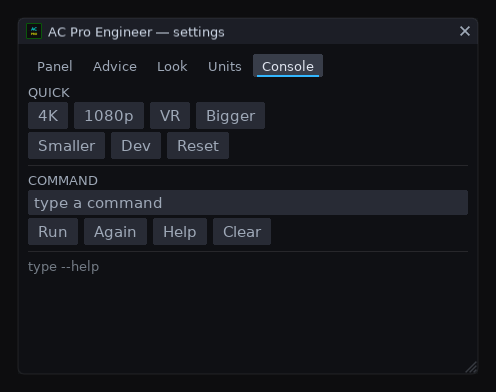

For what has no widget, and for what is faster to type than to find. One-press
presets for 4K, 1080p, VR, bigger, smaller, developer mode and reset; then a
command line taking `--scale`, `--width`, `--bar`, `--backing`, `--accent`,
`--vr`, `--units`, `--lines`, `--palette`, `--reset` and `--dev-mode`. That last
one is the only way to *turn on* developer mode — the Dev tab can only switch
itself off. `--help` lists the rest.

### In-game settings — Dev

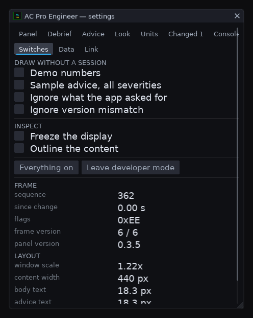

Red, and only in the window once developer mode is on — from the console's
`Dev` button or `--dev-mode`.

**Draw without a session** makes the panel lie on purpose: demo numbers, sample
advice at every severity, ignore what the application asked for, ignore a
version mismatch. That is how a layout gets judged without a car on track, and
how a block you cannot currently trigger gets looked at. **Inspect** freezes the
display and outlines the content rectangle. Below that, the frame's sequence,
age, flags and versions, and the layout's measured scale, width and text sizes —
the numbers behind the numbers.

The raw frame and the link state are here too, as the **Data** and **Link**
sub-tabs, so one window answers "what is going on" instead of three.

---

## Keyboard

| Key | Where | What it does |
|:---:|:---:|:---|
| **1** – **9** | everywhere | Switch tabs — the digits, not the function keys |
| **Tab** / **Shift+Tab** | everywhere | Next / previous tab |
| **F1** / **?** | everywhere | Help for the current tab |
| **Esc** / **Q** | everywhere | Back to the launcher, then quit |
| **Ctrl+C** | everywhere | Back to the launcher, or quit from it |
| **Ctrl+L** | everywhere | Switch language (English / Russian) |
| **Ctrl+S** | everywhere | Save a screenshot of the current screen |
| **↑ / ↓** | lists | Move through laps, chapters, setups, settings |
| **← / →** | tabs with sub-tabs | Switch sub-tab; change a setting's value |
| **S** | Analysis | Save the selected lap |
| **L** | Analysis | Load a lap from disk |
| **C** | Analysis | Toggle the ghost comparison |
| **E** | Analysis | Export the selected lap as MoTeC CSV |
| **F** | Analysis | Corners: show only the losses over a tenth |
| **B** | Setup | Open / close the Setup Cloud browser |
| **D** | Setup | Download the selected setup, or open the browser |
| **PgUp / PgDn** | Setup | Scroll the details pane |
| **A S D F G** | Settings | Jump to a settings category |
| **I** / **U** | Settings → OVERLAY | Install / remove the in-game panel |
| **C** | Settings → OVERLAY | Overlay diagnostics — why the panel is blank |
| **O** / **H** | Launcher | Open the review page / hide that banner |

**All of these are defaults.** **Settings → KEYS `[G]`** rebinds any of them:
`ENTER` arms the capture, the next key you press becomes the binding, `DEL`
restores the default and `ESC` cancels. A key another action already holds is
refused with the name of the action holding it, rather than silently shadowing
it — and two keys on *different* tabs are not a clash, so `C` compares laps on
Analysis and opens the overlay diagnostics on Settings without either refusing
the other. `?` and `Q` stay fixed, because the help modal names them in places a binding
cannot reach.

Bindings are stored as text in `config.json` (`"f1"`, `"ctrl+s"`,
`"shift+tab"`, `"1"`), so you can also edit them in a text editor. Cyrillic
layouts work without switching: bind `s` and `ы` works too.

The hint at the bottom right of every tab is printed from your bindings, so it
always names the key that actually does the thing.

---

## Command line

### `ac_pro_engineer` — the application

```
ac_pro_engineer [OPTIONS]
```

| Flag | What it does |
|---|---|
| `-d`, `--demo` | Run against a built-in simulated session. No game needed — this is the fastest way to see what the application looks like with data in it. |
| `--export-overlay <DIR>` | Write the in-game Lua panel into `<DIR>/ac_pro_engineer` and exit. For a game folder the application may not write to, an install it cannot find, or a second copy of AC. What lands is exactly the panel this build's frame is shaped for. |
| `-l`, `--log-level <LEVEL>` | `trace`, `debug`, `info` (default), `warn`, `error`. `debug` adds the telemetry loop and the overlay writer; `trace` adds every shared-memory read. |
| `--log <FILE>` | Write the log here instead of under the config directory. |
| `-s`, `--silent` | Do not write a log at all. |
| `-h`, `--help` | Full help, with the long explanation of each flag. |
| `-V`, `--version` | Print the version and exit. |

Environment variables the Linux build reads:

| Variable | Effect |
|---|---|
| `AC_PROTON_PATH` | The launcher used to start `shm-bridge.exe`. Defaults to `protontricks-launch`. |
| `AC_TEST_MODE` | Pretend to start the bridge without a Proton prefix. For development. |

### `shm-bridge.exe` — the Linux bridge

Runs **inside** the Proton prefix.

```bash
protontricks-launch --appid 244210 shm-bridge.exe
```

| Flag | What it does |
|---|---|
| *(none)* | Create the mappings and stay running. Type `exit` to stop it cleanly. |
| `--verify` | Open the overlay mapping the way CSP does, print what is in it, and exit. The one check that can only be made from inside the prefix. |
| `--help`, `--version` | As usual. |

### Development binaries and examples

| Command | What it does |
|---|---|
| `cargo run --bin simulator` | Write plausible AC telemetry into shared memory, so the whole application can be exercised with no game. |
| `cargo run --bin tui_tester` | Render every terminal screen to `screenshots/` as PNG. |
| `apps/lua/love/portraits.sh` | Render every *overlay* window and settings tab to `screenshots/` as PNG. |
| `cargo run -p ac_core --example bridge_probe` | Which bridge is on disk, which is running, and whether the overlay can work. |
| `cargo run -p ac_core --example engineer_probe [samples]` | The engineer's advice printed next to the telemetry that produced it. |
| `cargo run -p ac_core --example gen_lua_layout` | Regenerate the panel's `frame_layout.lua` from the Rust struct. |
| `cargo run -p ac_core --example publish_demo_frame` | Publish one known overlay frame, for the Lua conformance check. |
| `luajit apps/lua/tests/run_overlay.lua` | Drive the whole panel under LuaJIT with CSP stubbed. `ACPE_ALL=1` prints every string it drew. |
| `love apps/lua/love` | The panel running under LÖVE, with sliders for every field. `--test` runs it headless; `--shot NAME.png` saves a picture. |

---

## Configuration file

`config.json`, written as you change things and on exit.

| Platform | Path |
|---|---|
| Linux | `~/.config/raceengineer/config.json` |
| Windows | `%APPDATA%\RaceEngineer\RaceEngineer\config\config.json` |

Delete it to start from defaults; the application writes a fresh one. Keys it
does not recognise are ignored, and keys that are missing take their default, so
a config from an older version keeps working.

| Key | Default | What it is |
|---|---|---|
| `language` | `"English"` | `"English"` or `"Russian"` |
| `update_rate` | `16` | Milliseconds between telemetry ticks. Lower is smoother and costs more CPU. |
| `history_size` | `300` | Points kept for the graphs. |
| `auto_save` | `true` | Write settings on exit as well as on change. |
| `pressure_unit` | `"Psi"` | `"Psi"`, `"Bar"` or `"Kpa"` |
| `temp_unit` | `"Celsius"` | `"Celsius"` or `"Fahrenheit"` |
| `shift_point_offset` | `200` | RPM before the limiter that the shift light comes on. |
| `fuel_safety_margin` | `1.0` | Litres kept back in the strategy calculation. |
| `target_tyre_pressure` | `27.5` | The pressure the engineer measures against. |
| `target_hot_pressure_front` / `_rear` | `27.5` / `27.0` | Published to the overlay, which shows your distance from them. |
| `show_ghost_delta` | `true` | Measure the delta against your own best lap rather than AC's meter. |
| `alerts.tyre_pressure_min` / `_max` | `26.0` / `28.5` | Outside this is worth saying. |
| `alerts.tyre_temp_min` / `_max` | `70` / `105` | Cold and overheating, in °C. |
| `alerts.brake_temp_max` | `800` | Above this the brakes are cooking. |
| `alerts.fuel_warning_laps` | `3.0` | Laps of fuel left that triggers the warning. |
| `alerts.wear_warning` | `96` | Tyre life below which it is a warning, as a percentage. |
| `alerts.wear_critical` | `85` | And below which it is critical. |
| `overlay.show_telemetry` / `_engineer` / `_session` / `_timing` / `_fuel` | `true` | Which blocks the overlay is allowed to draw. |
| `overlay.engineer_lines` | `4` | How many advice lines reach the overlay, 0 to 8. |
| `overlay.debrief_lines` | `8` | Lines of each finished lap's debrief that reach the overlay, 0 to 8. Zero stops publishing one. |
| `overlay.broadcast_to` | `""` | Also send the computed frame here as JSON over UDP, `host:port`. Empty is off. |
| `overlay.broadcast_hz` | `10` | How many times a second to send there. |
| `overlay.broadcast_name` | `""` | The name that travels with it, so a receiver watching several drivers can tell them apart. |
| `overlay.startup_card` | `true` | Show the install card when the application starts. |
| `keys.*` | see [Keyboard](#keyboard) | One key per action, as text. |
| `data_path` | config directory | Where laps, exports, screenshots and records go. |
| `ac_install_path` | `""` | Force the Assetto Corsa folder. Empty means auto-detect. |
| `ac_documents_path` | `""` | Force the Documents folder AC reads setups from. Under Proton this is inside the prefix. |

The panel's own settings are **not** here — CSP keeps them in its own storage, so
uninstalling and reinstalling the overlay does not lose them.

---

## The UDP feed — writing your own front end

The application computes everything and publishes it. The in-game panel reads a
shared-memory mapping, which is the right transport inside the game and no use
outside it: it needs a bridge under Proton and it cannot cross a machine. So
everything else reads UDP.

Set an address and it starts:

```json
"overlay": { "broadcast_to": "127.0.0.1:9001", "broadcast_hz": 10 }
```

Off unless you set it. This is telemetry about you, and it leaves the machine
because you said so.

One JSON object per datagram, ten a second by default, carrying **the computed
frame** — not raw telemetry. Speed, gear, four corners, lap times, the
engineer's advice and the last three laps of debrief, already analysed. A
receiver draws and needs to know nothing about which simulator produced it.

```json
{
  "magic": "acpe", "schema": 1, "app_version": "0.3.6",
  "game": "assetto_corsa", "driver": "", "sequence": 12043,
  "speed_kmh": 214.0, "gear": 5, "rpm": 7400, "max_rpm": 8500,
  "fuel_litres": 41.2, "fuel_laps_remaining": 13.3, "delta_seconds": -0.284,
  "lap_count": 7, "best_lap_ms": 91380, "last_lap_ms": 92450, "stint_laps": 7,
  "corners": [ { "pressure_psi": 26.8, "temp_c": 88.0, "temp_inner_c": 92.0,
                 "temp_outer_c": 84.0, "wear_percent": 98.0,
                 "brake_temp_c": 420.0, "laps_remaining": 10.5 } ],
  "advice": [ { "severity": 1, "text": "Fronts over 28.4 psi (target 27.5)" } ],
  "debrief": [ { "lap_number": 12, "lap_time_ms": 91234,
                 "sectors_ms": [28540, 31120, 31574],
                 "lines": [ { "severity": 1, "text": "…" } ] } ]
}
```

`magic` is always `"acpe"`, so a receiver on a shared port can tell these from
somebody else's datagrams. `schema` changes when a key changes meaning or
disappears — not when the panel's own wire format moves, which is a different
number and none of your business. `severity` is 0 info, 1 warning, 2 critical.

Reading it is about fifteen lines:

```python
import json, socket
sock = socket.socket(socket.AF_INET, socket.SOCK_DGRAM)
sock.bind(("127.0.0.1", 9001))
while True:
    frame = json.loads(sock.recv(65535))
    print(frame["speed_kmh"], [line["text"] for line in frame["advice"]])
```

UDP because a lost frame costs nothing — another arrives in a tenth of a second
— and because a subscriber that stops reading must not be able to stall the loop
feeding the driver's own overlay.

That is the whole feature. **Nothing ships that reads this** — there is no
spectator client, no LAN mode and no relay, and pointing it at another machine
only means the datagrams arrive there. `docs/ARCHITECTURE.md` is where it is
meant to go; today it is an address to point at and a schema to write against.

## Troubleshooting

### The application says "AC NOT RUNNING" with Assetto Corsa open

The status bar tells three states apart on purpose:

- **AC NOT RUNNING** — no `acs.exe` process was found. On Linux, make sure you
  are running the game, not just the launcher.
- **AC RUNNING – NO DATA** — the process is there and its shared memory cannot be
  read. On Linux this is almost always `shm-bridge.exe` not running in the
  prefix. On Windows, try starting the application before the game.
- **LIVE** — telemetry is arriving.

### The in-game panel says "Waiting for AC Pro Engineer"

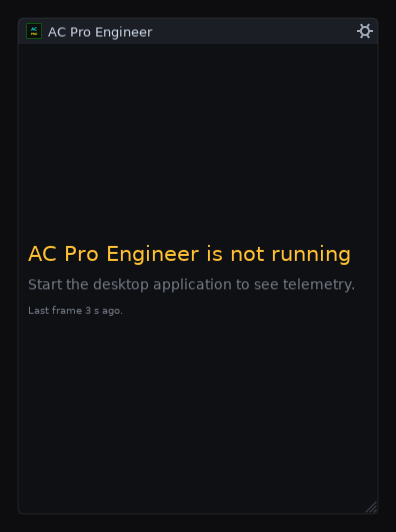

In order, cheapest first:

1. **Is the desktop application running?** The panel draws nothing without it.
2. **On Linux, is the bridge running in the prefix?**

   ```bash
   protontricks-launch --appid 244210 shm-bridge.exe --verify
   ```

   If it cannot open the mapping, start `shm-bridge.exe` in the prefix first.
3. **Is the bridge new enough?**

   ```bash
   cargo run -p ac_core --example bridge_probe
   ```

   A bridge older than the frame maps too few bytes and CSP refuses the mapping
   **without any error**. This is the single most common cause. Press **[B]** on
   the launcher's overlay card, or build a new one.
4. **Is the panel the one this build ships?** The overlay card on the launcher
   compares them. If the game was already running when the application updated
   the files, restart Assetto Corsa — the panel says so itself when it notices.

### The in-game panel says "Waiting for the car"

Nothing is wrong. The application is running and Assetto Corsa has no telemetry
yet — you are in the menus, on a loading screen, or in the garage before the
session goes live. The panel's settings and status windows work throughout.

### The panel says "Version mismatch"

The application and the installed panel disagree about the shape of the frame.
Reinstall the panel: **Settings → OVERLAY → `[I]`**, or

```bash
ac_pro_engineer --export-overlay ~/somewhere
```

and copy the folder into `assettocorsa/apps/lua/` yourself.

### The panel is not in CSP's app list at all

- Custom Shaders Patch has to be installed. The launcher's overlay card says
  whether it found it.
- The folder has to be `assettocorsa/assets/frontends/csp-panel/` — CSP finds an
  app's entry point by folder name.
- Enable **AC Pro Engineer** in CSP's app sidebar once.

### The panel forgets its settings

Fixed in v0.3.5. Older versions declared `LAZY = FULL`, which tells CSP to unload
the script when the last window closes. Update the application; it rewrites the
panel on startup.

### The overlay window is tiny / unreadable on a 4K screen

Settings → Look → Screen has presets for 1080p, 1440p, 4K and VR. Or type
`--scale 2 --width 680 --bar 12` in the Console tab.

### The terminal says "TERMINAL TOO SMALL"

The UI needs 80×20 to lay out. Resize the window; the application asks for
140×40 at startup but terminals are free to ignore that.

### A key does nothing / does the wrong thing

Settings → KEYS `[G]` lists every action with the key it is on. If a binding
shows as *unreadable*, `config.json` has a typo in it — press `DEL` on that row
to restore the default.

### Content Manager shows a black screen, or invisible text

That is a Proton prefix problem, not this application. See
[Linux / Steam Deck / Proton](#linux--steam-deck--proton).

### The engineer is telling me my tyres are worn out on lap three

Fixed in v0.3.5 — the critical threshold used to be derived from the warning one
and fired at 94 % tyre life. If you are on an older version, raise
`alerts.wear_warning`. On v0.3.5 the two thresholds are separate and settable in
Settings → ENGINEER.

### Where are my laps, exports and screenshots?

Under `data_path` in the config — by default the config directory, in
`laps/`, `exports/` and `screenshots/`.

### How do I report a bug usefully?

The **status window** in the game shows the panel version, the application
version and the frame version at once; `bridge_probe` prints the bridge's. Quote
those four, say Windows or Linux, and attach the log — by default under the
config directory in `logs/ac_engineer.log`. Run with `--log-level debug` if the
problem is a connection that comes and goes.

---

## Linux / Steam Deck / Proton

Getting **Assetto Corsa, CSP and Content Manager** to run under Proton at all is
a separate problem from this application, and the reason the in-game panel works
once it is solved: CSP loads through Windows libraries Proton ships only as
stubs. Without them the launcher opens on a black screen and the game crashes as
soon as a Lua script runs.

**All the commands, in order.** `244210` is Assetto Corsa's Steam app id.

```bash
protontricks 244210 --force vcrun2019 corefonts
```

```bash
protontricks 244210 d3dcompiler_47
```

```bash
protontricks 244210 dwrite
```

What each one is for:

- **vcrun2019** — the Microsoft Visual C++ 2015–2022 runtimes CSP compiles and
  runs its Lua against. `--force` overwrites conflicting older versions already
  in the prefix.
- **corefonts** — Arial, Times New Roman and the rest, so interface layout does
  not fall apart around missing metrics.
- **d3dcompiler_47** — Direct3D's shader compiler. WPF, which Content Manager is
  written in, cannot draw its own controls without it.
- **dwrite** — switches DirectWrite to the native Windows library. This is what
  removes the invisible text inside Content Manager, and the same override is how
  CSP hooks the game.

**The registry entry that removes the black screen.** Open the prefix's registry
editor:

```bash
protontricks 244210 regedit
```

Under `HKEY_CURRENT_USER\Software\Microsoft\`, create a key named
`Avalon.Graphics`, and inside it a 32-bit DWORD called `DisableHWAcceleration`
set to `1`. That turns off the broken hardware acceleration the launcher window
would otherwise ask for.

**Steam launch options** for Assetto Corsa:

```
PROTON_NO_ESYNC=1 PROTON_NO_FSYNC=1 WINEDLLOVERRIDES="winemenubuilder.exe=d;dwrite=n,b" %command%
```

`PROTON_NO_ESYNC` / `PROTON_NO_FSYNC` trade a little throughput for the absence
of micro-stutter while Lua scripts and heavy traffic run. The override is what
makes Wine load the libraries installed above instead of its own stubs — CSP does
not load at all without `dwrite=n,b`.

**If CSP crashes on track load with `segoeui.ttf is missing`,** drop that font
into `steamapps/common/assettocorsa/content/fonts/system/`.

**To start over**, `protontricks 244210 wipe` removes the prefix's Windows
environment without touching cars, tracks or mods — then run through the steps
above from the top.

---

## For developers

### The shape of it

```
core/          ac_core — telemetry, analysis, the engineer, the overlay frame
tui/           ac_tui  — the terminal application, the key map, every screen
shm-bridge/    the Windows binary that bridges /dev/shm on Linux
apps/lua/      the CSP panel, and two harnesses that run it without the game
tests_suite/   integration tests over the whole pipeline
```

The desktop application computes everything and publishes a 712-byte
`#[repr(C)]` `OverlayFrame` once per tick. The panel reads fields and calls
ImGui. **Three artefacts encode that struct** — the application, `shm-bridge.exe`
and `assets/frontends/csp-panel/frame_layout.lua` — and changing it means changing
all three. `core/src/overlay/frame.rs` has the rules; `CLAUDE.md` has the
procedure and the traps.

The panel itself is a tree:

```
assets/frontends/csp-panel/
  ac_pro_engineer.lua      the entry point CSP loads, and nothing else
  frame_layout.lua         GENERATED from the Rust struct
  manifest.ini             the windows CSP opens
  acpe/settings.lua        what the driver chose, and making it stick
  acpe/i18n.lua            the panel's own words, in two languages
  acpe/theme.lua           colours, accents, the editable palette
  acpe/layout.lua          text sizes, spacing, the measured window
  acpe/format.lua          numbers into strings, once per settled frame
  acpe/frame.lua           the shared block and the snapshot drawn from it
  acpe/blocks.lua          one function per thing on screen
  acpe/controls.lua        the widgets the settings window is built from
  acpe/console.lua         typed commands, for what has no widget
  acpe/windows/*.lua       one file per window
```

### Checks, cheapest first

```bash
luajit apps/lua/tests/run_overlay.lua
```

Drives every window the panel exposes under real LuaJIT with CSP stubbed, and
insists the telemetry reached the screen, the settings reached storage, they
survived a reload, and a frame with no car is distinguished from a missing
application.

```bash
love apps/lua/love --test --settings
```

The panel under LÖVE for 120 frames, non-zero on a throw. `--shot name.png` takes
a picture.

```bash
cargo run --bin simulator     # in one terminal
cargo run -p ac_core --example engineer_probe
```

Fake telemetry, then the engineer's advice printed next to the numbers that
produced it.

```bash
cargo test --workspace
```

```bash
cargo clippy --workspace --all-targets -- -D warnings
```

```bash
cargo clippy --workspace --all-targets --target x86_64-pc-windows-gnu -- -D warnings
```

Both targets, before pushing. `CLAUDE.md` and `AGENTS.md` describe the working
rules, including the ones learned the hard way.

### Contributing

Issues and pull requests are welcome. Conventional Commits, and a commit body
that says what was wrong, why it mattered and how it was verified. If you change
the overlay frame, regenerate the layout and rebuild the bridge — there are tests
that will fail if you do not, and they exist because forgetting has cost
evenings.

---

## Security — why your antivirus might complain

This application reads Assetto Corsa's shared memory. That is what telemetry
tools do, and it is also a pattern some antivirus heuristics dislike.

- **It only reads.** It does not modify game files, inject code, or touch
  anything but its own overlay folder under `apps/lua/`.
- **It is entirely open source.** Audit it, or build it yourself from this
  repository.
- **The releases are built by GitHub Actions** from the tagged commit.
- If Windows Defender flags it, add the folder to your exclusions.

---

## Licence and credits

Released under the [MIT licence](LICENSE).

`shm-bridge` began as [Damir Jelić's](https://github.com/poljar) work on bridging
Wine shared memory and is used and extended here under the same terms.

Built with [ratatui](https://ratatui.rs), [tokio](https://tokio.rs) and
[Custom Shaders Patch](https://acstuff.ru/patch/). Not affiliated with Kunos
Simulazioni.
