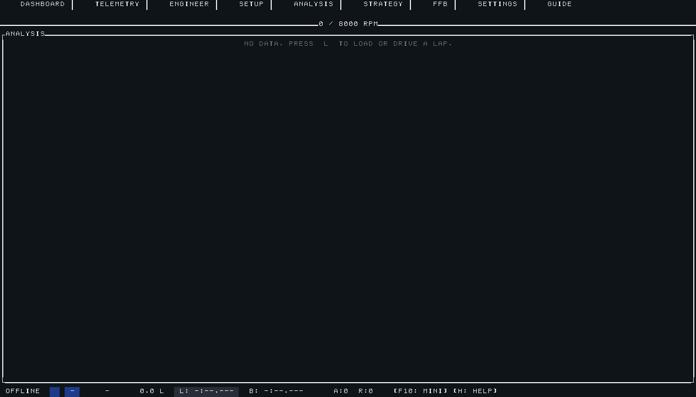

# 🏎️ AC Pro Engineer

[](https://github.com/Rgosh/ac-pro-engineer/releases)
[](LICENSE)
[](https://github.com/Rgosh/ac-pro-engineer/stargazers)
[](#linux-section)

**AC Pro Engineer** is a standalone telemetry analysis and real-time race engineering suite designed for pure performance and zero-lag operation in **Assetto Corsa** (AC / ACC). Built with Rust and Tokio for async performance, it runs as an ultra-fast **Terminal User Interface (TUI)** and native overlay system.

It provides real-time telemetry processing, AI copilot driving advice, lap recording & comparison, and a **one-click Setup Cloud** ecosystem.

> ⭐ **Support the Project**
> If you find this tool useful, please give it a **Star on GitHub**! It helps visibility and motivates further development.


---

### 🛡️ SECURITY & TRANSPARENCY

**False Positive Warning:** Since this tool is written in Rust and performs high-precision shared memory reading to fetch telemetry data, some antivirus software (Windows Defender/Google) may flag it as a false positive.

* **100% Open Source:** You can audit the code or compile it yourself from source.
* **Safe Behavior:** The tool **only reads** telemetry data. It does not modify game files or inject code.
* **Recommendation:** If flagged, please add the folder to your exclusions.

---

## 🚀 Why Use This?

* **Zero FPS Impact:** Utilizes **<0.1% CPU** and minimal RAM. Perfect for competitive racing and low-end PCs.
* **Hacker Aesthetics & High Speed:** Professional TUI design powered by Ratatui and Tokio async task scheduler.
* **Telemetry Persistence:** Record, save, and compare laps across sessions.
* **Smart Setup Cloud:** Browse, download, and compare car setups instantly.
* **Cross-Platform:** Native support for both **Linux** (Wine/Proton `shm-bridge`) and **Windows**.

---

## ✨ Full Menu & Feature Walkthrough

### **Launcher & Main Menu**


The main entry point upon running the application.

* **Quick Launch:** Instantly start telemetry tracking or configure app settings.
* **System Status:** Real-time connection status check for Assetto Corsa shared memory.
* **Auto-Updater:** Built-in update checking with version switching.

---

### **F1: Dashboard (Mission Control)**


Your core race dashboard for live telemetry monitoring.

* **Tyre Monitor:** Live tracking of tire pressures, temperatures (Inner/Middle/Outer), wear levels, and brake thermals.
* **Performance:** Speedometer, gear indicator, live RPM bar, and active delta.
* **Session & Electronics:** Fuel levels, lap counter, track position, and active driving aids (TC, ABS, Engine Map).

---

### **F2: Telemetry (Real-Time Physics)**


Deep dive into live car dynamics.

* **Live Graphs:** Real-time traces for Speed, RPM, Pedal Inputs (Throttle, Brake, Clutch), and Steering Angle.
* **Friction Circle (G-G Diagram):** Visualizes lateral and longitudinal G-forces to maximize tire grip.
* **Track Map:** Auto-generated vector track map updated in real time.

---

### **F3: Race Engineer (AI Copilot Advice)**


An intelligent real-time engineering copilot.

* **Live Advice:** Actionable feedback while driving (e.g., *"Tires cold"*, *"Lockups detected"*, *"Optimal shift point"*).
* **Driving Style Analysis:** Tracks Smoothness, Aggression, Steering Input, and Trail Braking index.
* **Event Counters:** Counts lockups, wheelspin, and traction loss events to highlight driving flaws.

---

### **F4: Setup Manager & Setup Cloud**


Compare local setup files and sync with the cloud.

* **Local Comparison:** Highlights parameter differences in fuel, aerodynamics, alignment, suspension, and dampers.
* **Cloud Setup Browser:** Press **'B'** to open the community setup browser for your active car/track combo.
* **One-Click Download:** Press **'D'** to download and install community `.ini` setups directly to your car setup folder.


---

### **F5: Analysis (Lap Recording & Ghost Comparison)**


Comprehensive post-stint lap analysis and comparison.

* **Save ('S') & Load ('L'):** Record laps to JSON files with full telemetry metadata.
* **Comparison Mode ('C'):** Load a ghost/reference lap to compare speed traces and find time loss locations.
* **Driver Skills Radar:** Spider-chart evaluating Smoothness, Aggression, Consistency, Car Control, and Tire Management.

---

### **F6: Strategy (Stint & Fuel Planning)**


Pit strategy and environmental condition monitoring.

* **Fuel Calculator:** Calculates average consumption per lap, laps remaining, and required refuel amounts.
* **Environmental Data:** Live tracking of track grip level, air temperature, asphalt temperature, and wind speed.

---

### **F7: FFB Tuning (Force Feedback Optimization)**

Dedicated Force Feedback diagnostic tab.

* **FFB Clipping Monitor:** Detects wheel rim force saturation to prevent FFB clipping.
* **Recommended Gain:** Suggests optimal FFB gain settings per car model.

---

### **F8: Settings (App & Localization Config)**

Application configuration panel.

* **Language Toggle:** Instant switching between **English** and **Russian**.
* **Localization:** Translations loaded from external `data/locales/*.json` files.
* **Telemetry Units:** Toggle between Metric (°C, bar, km/h) and Imperial (°F, PSI, mph).
* **Alert Thresholds:** Customize temperature, pressure, and fuel warning thresholds.

---

### **F9: Guide (User Manual & Reference)**

Built-in interactive documentation.

* **Keyboard Controls Reference:** Quick reference for all tab shortcuts and modal controls.
* **Setup Tuning Guide:** Tips on how to fix understeer, oversteer, and tire overheating.

---

## 🎮 Controls & Shortcuts

| Key | Context | Action |
|:---:|:---:|:---|
| **F1 - F9** | Global | Switch Tabs (Dashboard, Telemetry, Engineer, Setup, Analysis, Strategy, FFB, Settings, Guide) |
| **Tab / Shift+Tab** | Global | Cycle forward/backward through tabs |
| **Q** / **Esc** | Global | Return to Launcher / Quit Application |
| **L** | Global | Switch language (English / Russian) |
| **F10** | Global | Toggle Master In-Game Overlay |
| **F11** | Global | Toggle Overlay Control Center menu |
| **?** | Global | Toggle Help modal |
| **B** | Setup Tab | Open/Close Setup Cloud Browser |
| **D** | Setup Tab | Download selected cloud setup |
| **S** | Analysis Tab | Save current lap telemetry to file |
| **C** | Analysis Tab | Toggle Lap Comparison Mode |

---

## 📦 Installation & Quick Start

### Running standard release:
1. Download `ac_pro_engineer` from the [Releases page](https://github.com/Rgosh/ac-pro-engineer/releases).
2. Launch `ac_pro_engineer`.
3. Start Assetto Corsa and hit the track!

### Building and Running from Source:

To run the application using `cargo run`:

```bash
git clone https://github.com/Rgosh/ac-pro-engineer.git
cd ac-pro-engineer

# Run main TUI application
cargo run

# Run automated PNG screenshot generator
cargo run --bin tui_tester
```

---

<a name="linux-section"></a>

##  Linux Setup Guide

Reading Assetto Corsa shared memory on Linux under Wine/Proton uses the included [`shm-bridge`](file:///home/rgosh/projects/RaceEngineer/shm-bridge).

### Building for Linux
1. Build native Linux binary:
   ```bash
   cargo build --bin ac_pro_engineer --release
   ```
2. Build Windows `shm-bridge.exe` target:
   ```bash
   cargo build --bin shm-bridge --target x86_64-pc-windows-gnu --release
   ```
3. Run `ac_pro_engineer` before starting `acs.exe`.
