# 🏎️ AC Pro Engineer

[](https://github.com/Rgosh/ac-pro-engineer/releases)
[](LICENSE)
[](https://github.com/Rgosh/ac-pro-engineer/stargazers)
[](#linux-section)
[](https://github.com/Rgosh/ac-pro-engineer/actions/workflows/release.yml)

**AC Pro Engineer** is a standalone high-performance telemetry analyzer and real-time race engineering suite for **Assetto Corsa** (AC / ACC). Written in Rust with Tokio async task scheduling, it operates with zero FPS drop as a resolution-independent **Terminal User Interface (TUI)** and native desktop overlay system.

It features real-time telemetry processing, AI copilot driving advice, corner-by-corner tire pressure optimization, sector split analytics, and a **one-click Setup Cloud** ecosystem.

> ⭐ **Support the Project**
> If you find this tool useful, please give it a **Star on GitHub**! It helps visibility and motivates further development.

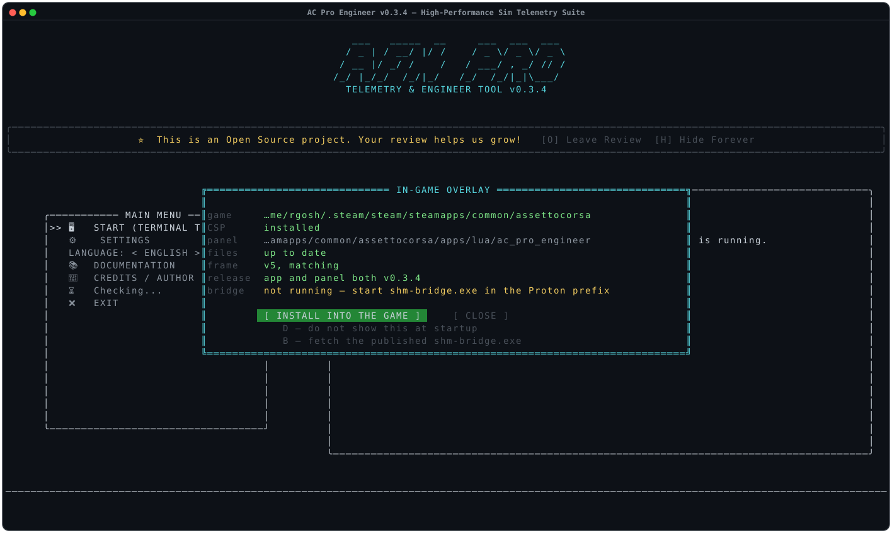

---

### 🛡️ SECURITY & TRANSPARENCY

**False Positive Warning:** Since this tool is written in Rust and performs high-precision shared memory reading to fetch telemetry data, some antivirus software (Windows Defender/Google) may flag it as a false positive.

* **100% Open Source:** Audit the code or compile it yourself directly from source.
* **Safe Memory Access:** The tool **only reads** telemetry data. It does not modify game files or inject code.
* **Recommendation:** If flagged, please add the folder to your exclusions.

---

## 🚀 Why Use This?

* **Zero FPS Impact:** Utilizes **<0.1% CPU** and minimal RAM. Perfect for competitive sim racing and low-end PCs.
* **Hacker Aesthetics & High Speed:** Professional TUI design powered by Ratatui and Tokio async task scheduler.
* **Tire Thermal & Pressure Optimizer:** Calculates corner-by-corner PSI adjustments based on live tire temperature gradients.
* **Telemetry Persistence:** Record, save, and compare laps across sessions with ghost traces.
* **Smart Setup Cloud:** Browse, download, and compare car setups instantly.
* **Cross-Platform:** Native support for both **Linux** (Wine/Proton `shm-bridge`) and **Windows**.

---

## ✨ Full Feature & Menu Walkthrough

### **Launcher & Main Menu** `[Added in v0.1.4]`


The main entry screen upon starting the application.

* **Engine Start:** Instant transition into live telemetry tracking mode.
* **System Status:** Auto-detects Assetto Corsa shared memory links.
* **Version Carousel:** Switch between installed versions using **Left/Right Arrows**.

---

### **F1: Dashboard (Mission Control)** `[Added in v0.1.0]`

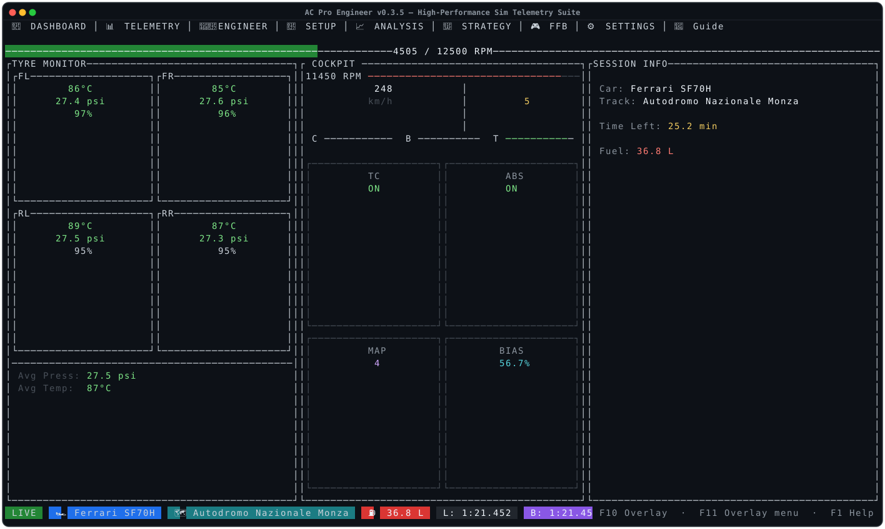
Your primary race dashboard for live telemetry monitoring.

* **Tyre Monitor:** Live tracking of tire pressures, temperatures (Inner/Middle/Outer), wear levels, and brake thermals.
* **Performance Bar:** Speedometer, gear indicator, live RPM bar, and active delta.
* **Session Info:** Fuel levels, lap counter, track position, and active driving aids (TC, ABS, Engine Map).

---

### **F2: Telemetry (Real-Time Physics & Friction Circle)** `[Added in v0.1.0]`

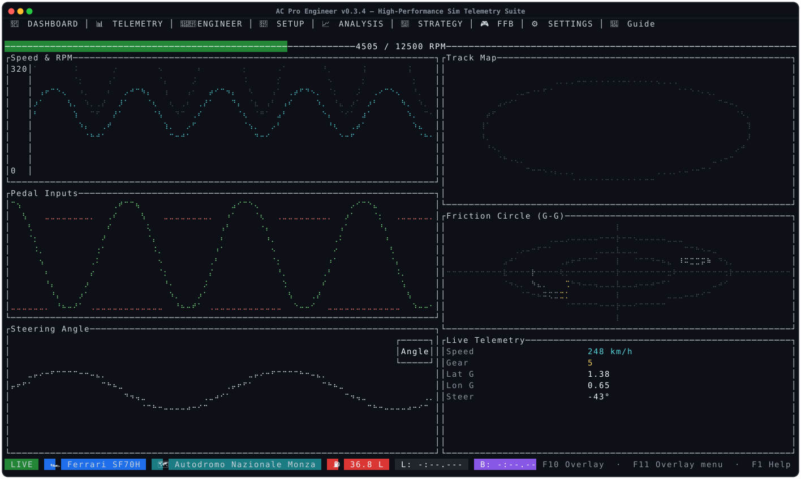
Deep dive into live car dynamics and track mapping.

* **Live Traces:** Real-time graphs for Speed, RPM, Pedal Inputs (Throttle, Brake, Clutch), and Steering Angle.
* **Friction Circle (G-G Diagram):** Visualizes lateral and longitudinal G-forces to maximize tire grip.
* **Vector Track Map:** Auto-generated track map updated in real time as you drive.

---

### **F3: Race Engineer & Tire Thermal Optimizer** `[Enhanced in v0.2.3]`

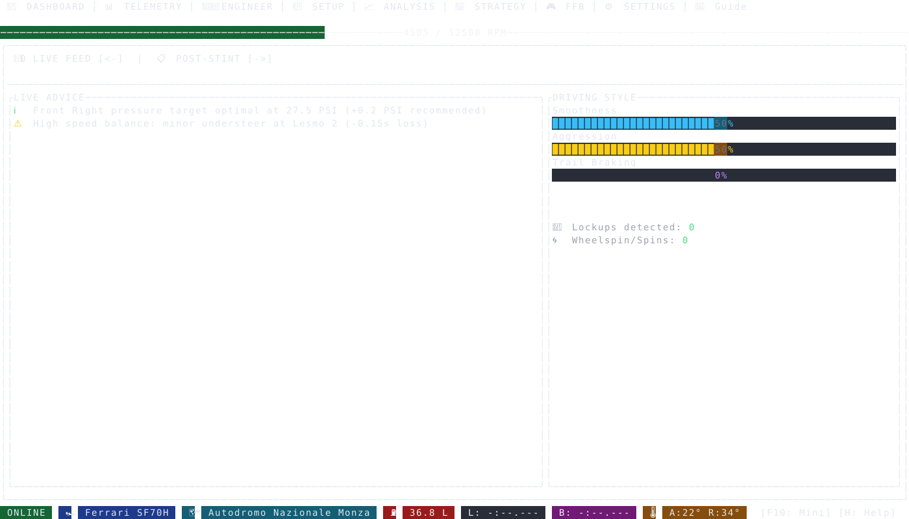
An intelligent real-time engineering copilot.

* **Live Advice:** Actionable feedback while driving (e.g., *"Tires cold"*, *"Lockups detected"*, *"Optimal shift point"*).
* **Tire Pressure & Thermal Balance Assistant:** Calculates corner-by-corner PSI adjustments (+0.4 PSI / -0.3 PSI) based on Inner vs. Outer tire temperature gradients (`[New in v0.2.3]`).
* **Driving Style Analysis:** Tracks Smoothness, Aggression, Steering Input, and Trail Braking index.

---

### **F4: Setup Manager & Local Comparison** `[Added in v0.1.2]`

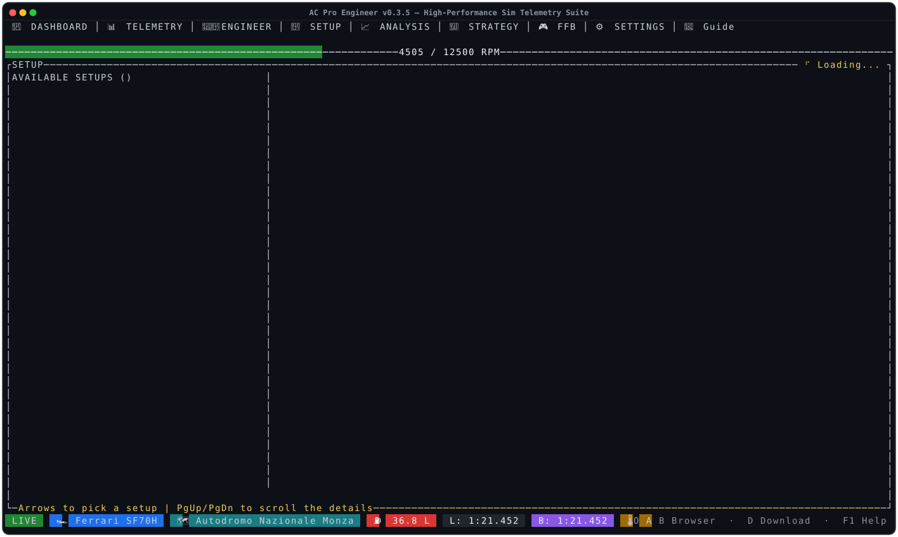
Compare local car setup files side-by-side.

* **Local Comparison:** Highlights parameter differences in fuel, aerodynamics, alignment, suspension, and dampers.
* **Reference Overlay:** Shows recommended baseline settings alongside active values.

---

### **F4 Sub-tab: Community Setup Cloud Browser** `[Added in v0.1.2]`

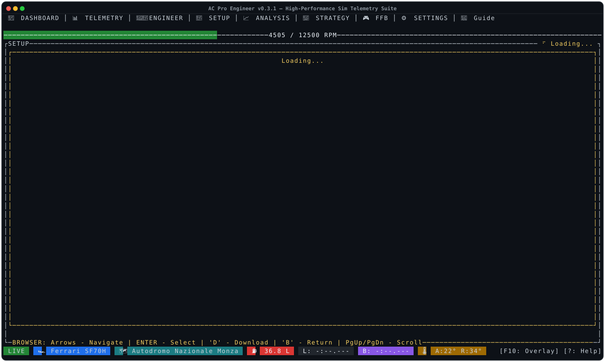
Browse and sync setups directly from the cloud repository.

* **Cloud Browser:** Press **'B'** to open community setups for your active car/track combo.
* **One-Click Download:** Press **'D'** to download and install community `.ini` setups directly to your car setup folder.

---

### **F5: Analysis (Lap History, MoTeC CSV Export & Ghost Comparison)** `[Enhanced in v0.2.3]`

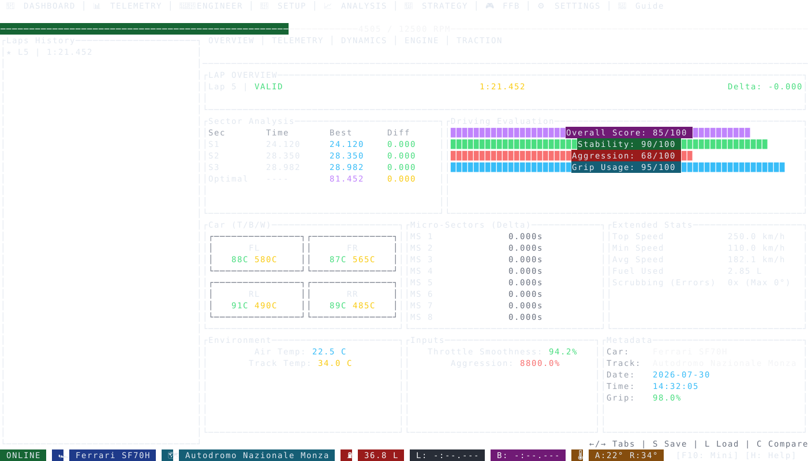
Comprehensive post-stint lap analysis and comparison.

* **Save ('S') & Load ('L'):** Record laps to JSON files with full telemetry metadata.
* **MoTeC-Compatible CSV Export ('E'):** Export lap telemetry traces directly to `.csv` format (`[New in v0.2.3]`).
* **Ghost Comparison ('C'):** Load a ghost/reference lap to overlay speed traces and identify time loss locations.
* **Lap Navigation (Up/Down):** Seamlessly switch between laps in the list to update all subtab metrics dynamically (`[New in v0.2.3]`).

---

### **F5 Sub-tab: Driver Skills Radar & Coach Report** `[Added in v0.1.3]`

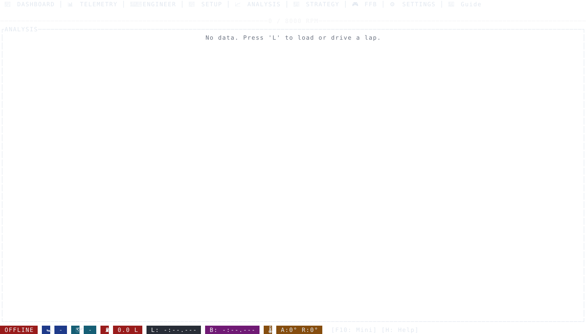
Detailed driver skill evaluation and automated coaching report.

* **Skill Spider Chart:** Evaluates Consistency, Car Control, Aggression, Smoothness, and Tire Management.
* **Coach Recommendations:** Identifies lockup habits, coasting percentages, and pedal overlap.

---

### **F6: Strategy (Stint Planning & Cold Tyre Pressure Calculator)** `[Enhanced in v0.2.3]`

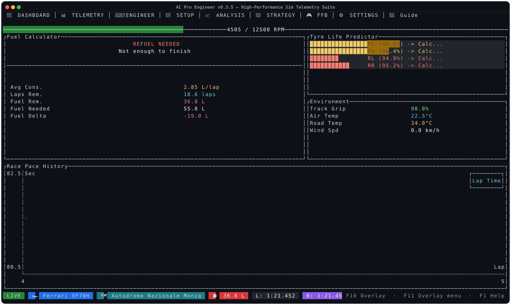
Pit strategy, stint planning, cold tyre pressure calculator, and predictive lap analytics.

* **Cold Tyre Pressure Calculator:** Computes target cold pressures based on ambient weather and track grip (`[New in v0.2.3]`).
* **Predictive Lap Engine:** Estimates expected lap time dynamically based on sector splits (`[New in v0.2.3]`).
* **Fuel Calculator:** Calculates average consumption per lap, laps remaining, and required refuel amounts.
* **Environmental Monitor:** Live tracking of track grip level, air temperature, asphalt temperature, and wind speed.

---

### **F7: FFB Tuning (Force Feedback Diagnostic)** `[Added in v0.2.0]`

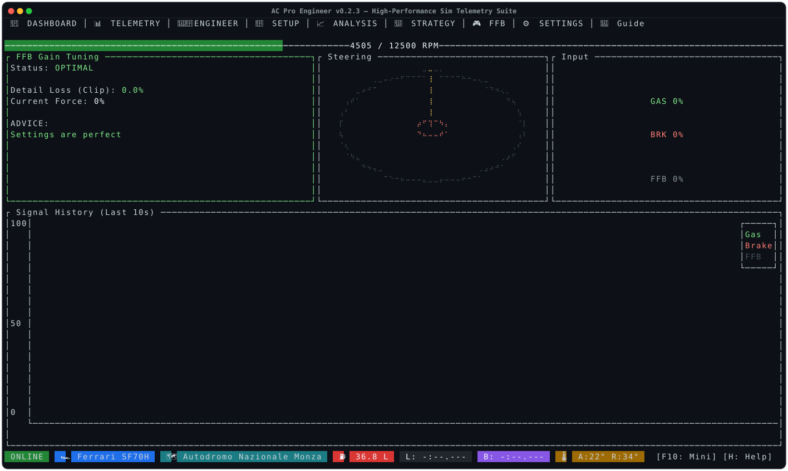
Dedicated Force Feedback diagnostic tab.

* **Clipping Monitor:** Detects wheel rim force saturation to prevent FFB clipping.
* **Recommended Gain:** Suggests optimal FFB gain settings per car model.

---

### **F8: Settings & JSON Localization** `[Enhanced in v0.2.3]`

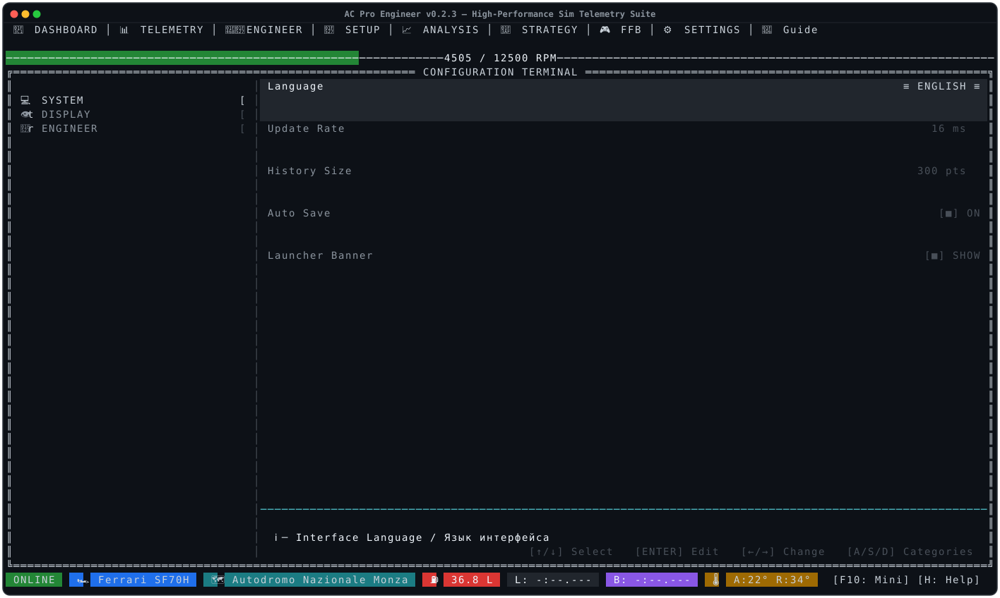
Application configuration panel.

* **JSON Localization:** Dynamically loads translations from external `data/locales/en.json` and `data/locales/ru.json` files (`[New in v0.2.3]`).
* **Target Hot Tyre Pressures:** Configure front and rear optimal tyre pressure targets (`[New in v0.2.3]`).
* **Telemetry Units:** Toggle between Metric (°C, bar, km/h) and Imperial (°F, PSI, mph).
* **Alert Thresholds:** Customize temperature, pressure, and fuel warning thresholds.

---

### **F9: Guide (User Manual & Setup Reference)** `[Enhanced in v0.2.3]`

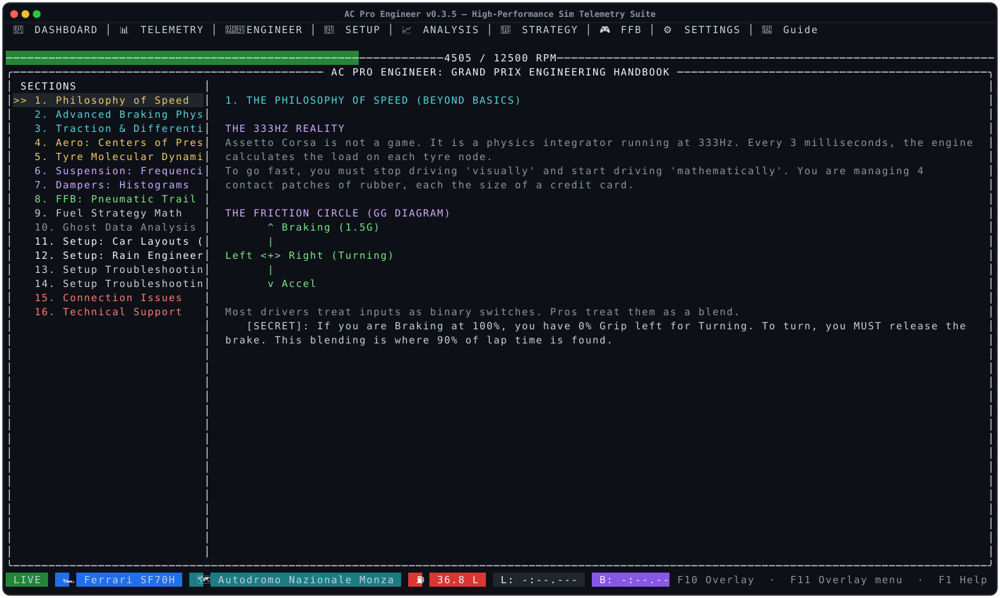
Built-in interactive documentation.

* **Decoupled Section Selection:** Navigate handbook chapters using **Up/Down** arrows independently of other tabs (`[New in v0.2.3]`).
* **Keyboard Controls Reference:** Quick reference for all tab shortcuts and modal controls.
* **Setup Tuning Guide:** Tips on how to fix understeer, oversteer, and tire overheating.

---

### **In-Game Overlay Control Center (F11)** `[Added in v0.2.1]`

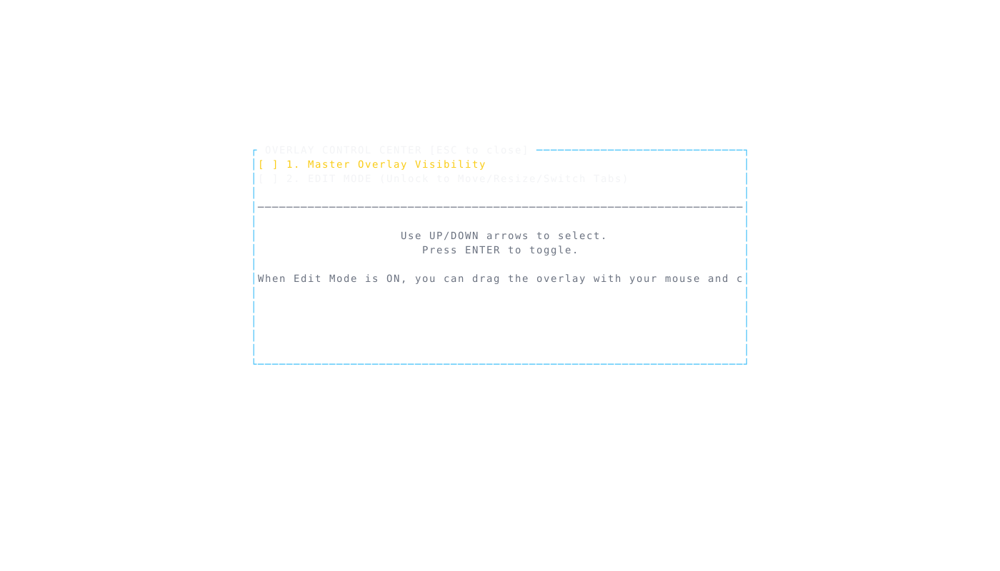
In-game overlay configuration menu.

* **Mode Selection:** Support for Native Desktop overlay.
* **Element Positioning:** Customize position and transparency of floating telemetry widgets.

---

### **Interactive Help Overlay (?)** `[Added in v0.2.1]`

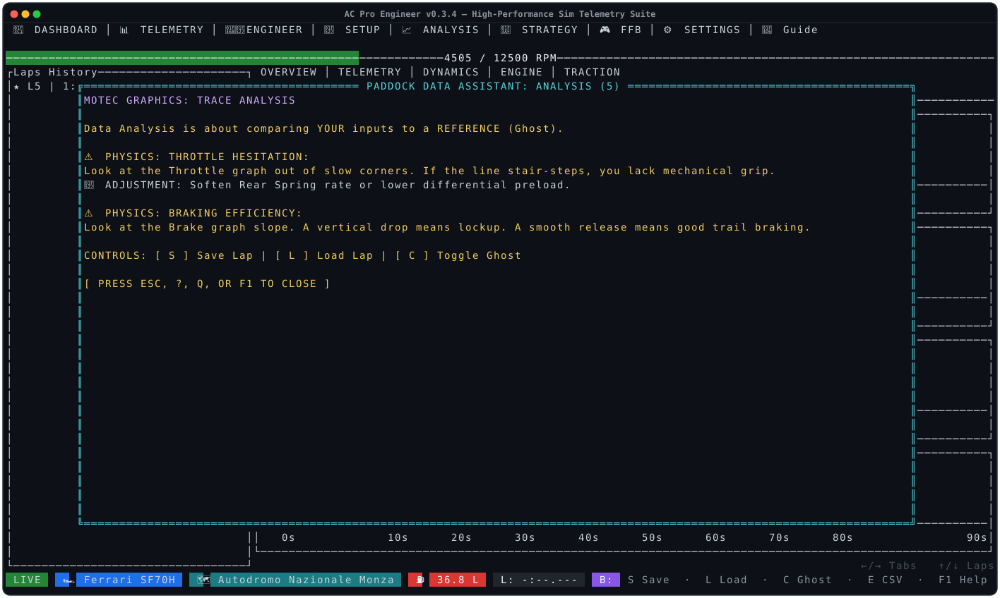
Quick help overlay available from any screen by pressing **'?'**.

---

## 🎮 Controls & Shortcuts

| Key | Context | Action |
|:---:|:---:|:---|
| **1 - 9** | Global | Switch Tabs (Dashboard, Telemetry, Engineer, Setup, Analysis, Strategy, FFB, Settings, Guide) |
| **Tab / Shift+Tab** | Global | Cycle forward/backward through tabs |
| **Q** / **Esc** | Global | Return to Launcher / Quit Application |
| **Ctrl+L** | Global | Switch language (English / Russian) |
| **F10** | Global | Toggle Master In-Game Overlay |
| **F11** | Global | Toggle Overlay Control Center menu |
| **?** / **F1** | Global | Toggle Interactive Help modal |
| **Up / Down** | Engineer / Analysis / Guide / Setup | Navigate debriefing laps, analysis laps, guide chapters, or setups |
| **Left / Right** | Engineer / Analysis | Switch subtabs (Live Feed vs Debriefing / Overview vs Graphs vs Dynamics...) |
| **B** | Setup Tab | Open/Close Setup Cloud Browser |
| **PgUp / PgDn** | Setup Tab | Scroll setup details |
| **D** | Setup Tab | Download selected cloud setup |
| **S** | Analysis Tab | Save the selected lap's telemetry to file |
| **E** | Analysis Tab | Export selected lap telemetry to MoTeC-compatible CSV (`[New in v0.2.3]`) |
| **C** | Analysis Tab | Toggle Lap Comparison Mode |

---

## 📦 Installation & Quick Start

### Running standard release:
1. Download `ac_pro_engineer` from the [Releases page](https://github.com/Rgosh/ac-pro-engineer/releases).
2. Launch `ac_pro_engineer`.
3. Start Assetto Corsa and hit the track!

### Building and Running from Source:

To run the application using `cargo run`:

```bash
git clone https://github.com/Rgosh/ac-pro-engineer.git
cd ac-pro-engineer

# Run main TUI application
cargo run

# Run automated SVG vector screenshot generator
cargo run --bin tui_tester

# Build release package on Linux
chmod +x build_release.sh && ./build_release.sh
```

---

<a name="linux-section"></a>

##  Linux Setup Guide

Reading Assetto Corsa shared memory on Linux under Wine/Proton uses the included [`shm-bridge`](./shm-bridge).

### Building for Linux
1. Build using the provided bash script:
   ```bash
   chmod +x build_release.sh
   ./build_release.sh
   ```
2. Run `ac_pro_engineer` before starting `acs.exe`.

### The bridge and the in-game panel

The bridge is not optional for the overlay on Linux. The application writes the
panel's frame into `/dev/shm` itself, but only `shm-bridge.exe` — running inside
the game's Proton prefix — gives that file the Win32 name CSP is able to open.
Without it the panel waits forever beside a mapping that is right there.

```bash
protontricks-launch --appid 244210 shm-bridge.exe
```

Start it before the game and leave it running. To find out which bridge is in
play and whether the overlay can work at all:

```bash
cargo run -p ac_core --example bridge_probe
```

It reports the bridge on disk, the bridge running, and the version, protocol and
mapped size of each against what this build needs. The launcher's overlay card
shows the same verdict in one line, and **[B]** on that card fetches the
published bridge — verifying it before it replaces anything, and keeping the
previous one as `shm-bridge.exe.previous`.

> **A bridge older than the overlay maps AC's own pages and nothing else.** It
> starts, reports no error, and no overlay mapping is ever created. Every release
> up to and including v0.3.3 published one of those, so until a newer release is
> cut the only bridge that works is one built from this checkout:
>
> ```bash
> cargo build --release -p shm-bridge --target x86_64-pc-windows-gnu
> ```

### Getting Assetto Corsa, CSP and Content Manager to run under Proton

Translated from the crib sheet kept in the game folder, and the reason the
in-game panel works at all: CSP loads through Windows libraries Proton ships
only as stubs. Without them the launcher opens on a black screen and the game
crashes as soon as a Lua script runs.

**All the commands, in order.** `244210` is Assetto Corsa's Steam app id.

```bash
protontricks 244210 --force vcrun2019 corefonts
```

```bash
protontricks 244210 d3dcompiler_47
```

```bash
protontricks 244210 dwrite
```

What each one is for:

- **vcrun2019** — the Microsoft Visual C++ 2015–2022 runtimes CSP compiles and
  runs its Lua against. `--force` overwrites conflicting older versions that
  are already in the prefix.
- **corefonts** — Arial, Times New Roman and the rest, so interface layout does
  not fall apart around missing metrics.
- **d3dcompiler_47** — Direct3D's shader compiler. WPF, which Content Manager
  is written in, cannot draw its own controls without it.
- **dwrite** — switches DirectWrite to the native Windows library. This is what
  removes the invisible text inside Content Manager, and the same override is
  how CSP hooks the game.

**The registry entry that removes the black screen.** Open the prefix's
registry editor:

```bash
protontricks 244210 regedit
```

Under `HKEY_CURRENT_USER\Software\Microsoft\`, create a key named
`Avalon.Graphics`, and inside it a 32-bit DWORD called `DisableHWAcceleration`
set to `1`. That turns off the broken hardware acceleration the launcher window
would otherwise ask for.

**Steam launch options** for Assetto Corsa:

```
PROTON_NO_ESYNC=1 PROTON_NO_FSYNC=1 WINEDLLOVERRIDES="winemenubuilder.exe=d;dwrite=n,b" %command%
```

`PROTON_NO_ESYNC` / `PROTON_NO_FSYNC` trade a little throughput for the absence
of micro-stutter while Lua scripts and heavy traffic run. The override is what
makes Wine load the libraries installed above instead of its own stubs — CSP
does not load at all without `dwrite=n,b`.

**If CSP crashes on track load with `segoeui.ttf is missing`,** drop that font
into `steamapps/common/assettocorsa/content/fonts/system/`.

**To start over**, `protontricks 244210 wipe` removes the prefix's Windows
environment without touching cars, tracks or mods — then run through the steps
above again from the top.
